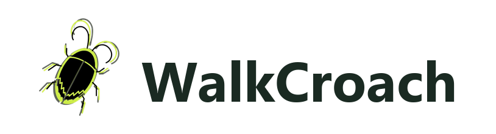

<p align="center">
  
</p>

<h1 align="center">One memory layer for agentic work across six surfaces</h1>

<p align="center"><em>Shared CockroachDB memory for Web, Chrome, IDE, CLI, Desktop, and SDK</em></p>

<p align="center">
  Build and ship with agents that remember project context. Capture in the browser,
  decide in the IDE, automate from the CLI, or call the same memory graph from the
  public SDK. Provenance stays attached; the graph follows the account.
</p>

<p align="center">
  Web · Chrome · IDE · CLI · Desktop · SDK / MCP
</p>
<p align="center">
  Shared memory · Approvals · BYOK · OpenAPI <code>/v1</code> · MCP tools
</p>
<p align="center">
  CockroachDB · AWS Bedrock · MIT · Self-hostable surfaces
</p>

<p align="center"><strong>Built for durable agent memory on CockroachDB and AWS</strong></p>

<p align="center">
  <a href="https://github.com/Tolu-Orina/walkcroach/stargazers"></a>
  <a href="https://github.com/Tolu-Orina/walkcroach/network/members"></a>
  <a href="https://github.com/Tolu-Orina/walkcroach/blob/main/LICENSE"></a>
  <a href="https://www.npmjs.com/package/@walkcroach/sdk"></a>
  <a href="https://www.npmjs.com/package/@walkcroach/cli"></a>
  <a href="https://www.npmjs.com/package/@walkcroach/sdk-mcp"></a>
  <a href="https://open-vsx.org/extension/walkcroach/walkcroach-ide"></a>
  <a href="https://chrome.google.com/webstore/detail/oljdeopppkgfjeoobgochpddchlhmeaj"></a>
  
</p>

<p align="center">
  <a href="https://github.com/Tolu-Orina/walkcroach/actions/workflows/publish-sdk.yml"></a>
  <a href="https://github.com/Tolu-Orina/walkcroach/actions/workflows/publish-cli.yml"></a>
  <a href="https://github.com/Tolu-Orina/walkcroach/actions/workflows/publish-ide.yml"></a>
  <a href="https://github.com/Tolu-Orina/walkcroach/actions/workflows/publish-chrome.yml"></a>
</p>

<p align="center">
  <a href="https://walkcroach.rinegansolutions.com"></a>
  <a href="https://walkcroach.rinegansolutions.com/app/developer"></a>
  <a href="https://open-vsx.org/extension/walkcroach/walkcroach-ide"></a>
  <a href="https://github.com/Tolu-Orina/walkcroach/releases"></a>
</p>

```bash
npx @walkcroach/cli@latest auth login
npx @walkcroach/cli@latest run "explain this repo"
```

```bash
npm install @walkcroach/sdk
```

## What this is

WalkCroach is an agentic work platform: coding agents you steer locally, plus a hosted platform for browser work, app building, and public memory APIs. All of it shares one CockroachDB memory layer.

`sdk-host` is an internal programmatic host over `agent-engine`. It is not a public package. `@walkcroach/agent-engine` stays private.

| Surface | Distribution | Version (in tree) |
|---|---|---|
| Web (App Builder + developer portal) | [walkcroach.rinegansolutions.com](https://walkcroach.rinegansolutions.com) | private `0.1.0` |
| Chrome extension | [Chrome Web Store](https://chrome.google.com/webstore/detail/oljdeopppkgfjeoobgochpddchlhmeaj) | `0.6.2` |
| IDE extension | [Open VSX](https://open-vsx.org/extension/walkcroach/walkcroach-ide) | `0.2.1` |
| CLI | npm `@walkcroach/cli` | `0.3.1` |
| SDK | npm `@walkcroach/sdk` | `0.2.1` |
| SDK MCP | npm `@walkcroach/sdk-mcp` | `0.2.1` |
| Desktop IDE (Code OSS fork) | Unsigned Windows preview | see [docs/walkcroach-desktop.md](./docs/walkcroach-desktop.md) |

| Role | URL |
|---|---|
| Portal | https://walkcroach.rinegansolutions.com |
| Public API | https://api.walkcroach.rinegansolutions.com |
| Chrome privacy policy | https://walkcroach.rinegansolutions.com/chrome-privacy.html |

Built for the CockroachDB × AWS Hackathon (Build with Agentic Memory).

## Architecture in one page

Two agent runtimes share memory contracts. They are not merged into one binary.

| Runtime | Package | Used by |
|---|---|---|
| Harness | `@walkcroach/agent-harness` | Web, Chrome, content runs |
| Engine | `@walkcroach/agent-engine` (private) | IDE, CLI, Desktop, sdk-host |

Shared contracts: `@walkcroach/memory-contracts`, OpenAPI `/v1`, and (for Desktop) `@walkcroach/agent-protocol`. Details and non-goals: [docs/ARCHITECTURE.md](./docs/ARCHITECTURE.md).

## Repo layout

```
walkcroach/
├── web/                              # SPA
├── chrome/                           # Manifest V3 extension (WXT)
├── ide/                              # VS Code / Open VSX extension
├── cli/                              # Terminal agent (same engine as IDE)
├── packages/agent-engine/            # Shared coding agent loop (private)
├── packages/sdk/                     # @walkcroach/sdk
├── packages/sdk-mcp/                 # MCP server over the memory API
├── packages/sdk-host/                # Programmatic HostAdapter (internal)
├── packages/memory-contracts/        # Shared memory kinds / export
├── packages/templates/               # Shared project templates
├── skills/web/                       # WalkCroach Agent Skills (Web)
├── infra-backend/                    # Terraform + Lambda packages
├── infra-web/                        # S3 / CloudFront
├── ci-cd/                            # CodePipeline templates
├── tests/                            # Cross-surface + Playwright E2E
└── docs/                             # Living docs + archive
```

`web/`, `chrome/`, `ide/`, `cli/`, `packages/agent-engine/`, `infra-backend/`, and `tests/` each install their own dependencies. There is no root npm workspace.

Documentation index: [docs/README.md](./docs/README.md). Engineering status: [docs/walkcroach-master-doc.md](./docs/walkcroach-master-doc.md).

## Release and publish workflows

Surface releases are tag-driven GitHub Actions workflows under `.github/workflows/`. Manual `workflow_dispatch` defaults to dry-run (build and verify, no registry write). CodeBuild still builds and tests; publish jobs re-run their gates rather than trusting an artifact they did not produce.

| Workflow | Trigger tags | Registry | GitHub environment | Auth |
|---|---|---|---|---|
| [publish-sdk.yml](./.github/workflows/publish-sdk.yml) | `sdk-v*`, `sdk-mcp-v*` | npm (`@walkcroach/sdk`, `@walkcroach/sdk-mcp`) | `npm-publish` | OIDC trusted publishing |
| [publish-cli.yml](./.github/workflows/publish-cli.yml) | `cli-v*` | npm (`@walkcroach/cli`) | `npm-publish` | OIDC trusted publishing |
| [publish-ide.yml](./.github/workflows/publish-ide.yml) | `ide-v*` | Open VSX (`walkcroach.walkcroach-ide`) | `ovsx-publish` | `OVSX_PAT` |
| [publish-chrome.yml](./.github/workflows/publish-chrome.yml) | `chrome-v*` | Chrome Web Store | `cws-publish` | OAuth client + refresh token |

Tag version must match the package `version` field (for example `chrome-v0.6.2` ↔ `chrome/package.json` `0.6.2`). Push one release tag at a time.

### Current publish status (2026-08-11)

Queried from GitHub Actions for the latest successful tag run per workflow:

| Package | Tag | Workflow result | Notes |
|---|---|---|---|
| `@walkcroach/sdk` | `sdk-v0.2.1` | Success | Published to npm |
| `@walkcroach/sdk-mcp` | `sdk-mcp-v0.2.1` | Success | Published to npm |
| `@walkcroach/cli` | `cli-v0.3.1` | Success | Published to npm |
| IDE extension | `ide-v0.2.1` | Success | Published to Open VSX (VS Marketplace step still commented out in the workflow) |
| Chrome extension | `chrome-v0.6.2` | Success | Package uploaded and submitted for CWS review. A green run means submitted, not yet live in the store. |

Chrome submit can still fail with `Publish condition not met: Privacy policy link is not reachable` when the **dashboard** Privacy practices URL is wrong or unreachable. That is unrelated to the zip. Fix the dashboard URL (`https://walkcroach.rinegansolutions.com/chrome-privacy.html`), then re-run the workflow with `publish_only: true`. See [chrome/store/PRIVACY_PRACTICES.md](./chrome/store/PRIVACY_PRACTICES.md).

Run history: [Actions](https://github.com/Tolu-Orina/walkcroach/actions).

## Prerequisites

- Node.js 22 (publish workflows use 22; local Node 20+ is usually enough for day-to-day work)
- CockroachDB Cloud cluster and connection string
- AWS account with Bedrock access (Nova 2 Lite + Titan Embeddings V2)

## Install (consumers)

CLI quick start is at the top of this README. IDE: install `walkcroach.walkcroach-ide` from
[Open VSX](https://open-vsx.org/extension/walkcroach/walkcroach-ide), or from the
`.vsix` on [Releases](https://github.com/Tolu-Orina/walkcroach/releases).

CLI and IDE sign in against the same WalkCroach account as the web app and share
the same CockroachDB memory layer.

SDK (and optional MCP):

```bash
npm install @walkcroach/sdk
npm install @walkcroach/sdk-mcp
```

Default API base: `https://api.walkcroach.rinegansolutions.com/v1`.

## Quick start (from source)

```bash
cp .env.example .env
# fill in CRDB_CONNECTION_STRING and AWS credentials

# Backend packages + Lambda
cd infra-backend
npm install
npm run build:packages
npm run smoke:memory

# Web SPA
cd ../web
npm install
npm run dev

# Chrome extension (needs Chrome BFF on :3002)
cd ../infra-backend && npm run dev:chrome
cd ../chrome && npm install && npm run dev

# IDE extension
cd ../packages/agent-engine && npm install && npm test && npm run build
cd ../../ide && npm install && npm run build
# then Run "Run WalkCroach IDE Extension" (see ide/README.md)

# CLI
cd ../cli && npm install && npm run build
```

Per-surface detail: `web/`, `chrome/`, `ide/`, `cli/` READMEs. Chrome store kit: [chrome/store/README.md](./chrome/store/README.md). Security cadence: [docs/SECURITY-CHECKS.md](./docs/SECURITY-CHECKS.md).

## Licence

MIT. See [LICENSE](./LICENSE).

Third-party: StackBlitz WebContainer (`@webcontainer/api`) is proprietary and used under its published terms. It is not vendored into this MIT tree.
