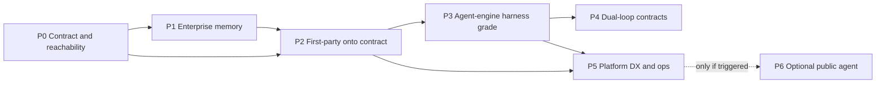

# WalkCroach SDK & Agent Platform — Enterprise Build Plan

> **Artifact type:** Target architecture + phased implementation plan (EA skill).  
> **Scope:** Build *beyond* today’s `@walkcroach/sdk`, `@walkcroach/sdk-mcp`, `/v1` memory API, and the private `@walkcroach/agent-engine` that powers IDE / CLI / Desktop / sdk-host — to **enterprise production grade**.  
> **Not this doc:** An npm-publish checklist. Publishing is a *consequence* of maturity, not the goal.  
> **Basis:** Code review Aug 2026 + EA `sdk-platform` / `walkcroach-context` / `agentic-systems` + industry practice (governed multi-tenant memory, agent harness engineering, layered SDKs).  
> **Epistemic labels:** **verified** = in repo; **inferred** = reasoned from mechanism; **assumed** = filled to plan.

**Status:** Phase 0–5 + Pre-P6 in repo; Web + Chrome memory UX on `@walkcroach/sdk` (Cognito). APIGW apply + migration still required for live env.  
**Dominant trade-off:** We invest in **one memory contract + one coding harness quality bar** before surface count or new agent products. That slows “new shiny API” work and rejects merging agent-engine into agent-harness.

**Decision / Ask:** Accept the layering and phase order below. Reject “ship agent-engine as the public SDK.” Confirm retention / compliance target (P1) before changing `gc.ttlseconds`.

---

## 1. Recommendation (lead)

WalkCroach’s moat is already correctly identified in code: **CockroachDB-backed, project-scoped, supersede-preserving, time-travelable memory**, exposed as `@walkcroach/sdk` + MCP, consumed eventually by every surface. The coding loop (`agent-engine`) is a **private harness** that must become production-grade *because first-party IDEs depend on it*, and because `sdk-host` / content runs sit on it — not because it is the public product.

Enterprise grade here means:

| Pillar | Meaning for WalkCroach |
|---|---|
| **Contract unity** | One memory semantics API; first-party hosts stop inventing parallel clients |
| **Tenant safety** | Fail-closed ownership on every path; no unscoped vector scans; key scopes enforced |
| **Governed lifecycle** | Supersede + audit + retention policy that matches enterprise expectations (not ~25h surprise) |
| **Harness discipline** | Uniform tool pipeline, approvals that don’t cross sessions, budgets, evals of the *harness* |
| **Operability** | SLIs/SLOs, tracing, quotas, abuse controls, fitness functions that detect drift |
| **Layered packages** | Public memory SDK ≠ private HostAdapter engine (Vercel AI SDK / MS Agent Framework lesson) |

---

## 2. Current state (honest)

### 2.1 What is already strong (**verified**)

| Capability | Where |
|---|---|
| Typed memory client: remember / recall / list / asOf / diff / export / import | `packages/sdk` |
| Client-side `projectId` UUID enforcement (index correctness) | `packages/sdk/src/memory.ts` |
| Error taxonomy + retry policy (no blind 500 retry on writes) | `packages/sdk/src/http.ts`, `errors.ts` |
| Browser secret-key refusal | `packages/sdk/src/http.ts` |
| Cognito-only key mint/list/revoke; keys cannot mint keys | `lambda-ide/.../handlers/keys.ts` |
| MCP tools aligned to harness names; outputSchema; deterministic tool order | `packages/sdk-mcp/src/tools.ts` |
| Host-agnostic coding loop, approvals, worktrees, MCP, sessions, evals | `packages/agent-engine` |
| Programmatic sandbox host over engine | `packages/sdk-host` |
| Developer portal UI (keys / docs / health) | `web/src/app/developer/*` |
| Memory retention zone raised to 90_000s (~25h) | migration `034_memory_retention.sql` |
| Partial CloudWatch/SNS for memory/creative | `infra-backend/modules/observability-*` |

### 2.2 Critical gaps for “enterprise production” (**verified** unless noted)

| Gap | Why it blocks enterprise grade |
|---|---|
| **First-party surfaces do not use `@walkcroach/sdk`** | Parallel memory clients (IDE BFF bridge, CLI, web, chrome, harness) → semantic drift; moat not enforced by one contract |
| **`ProjectMemoryBridge` ≠ SDK** | Engine talks `/ide/v1/memory/*`; SDK talks `/v1/memory/*` — two protocols for one product |
| **API Gateway: `/v1/{keys,memory,…}` not clearly routed to ide Lambda** | **Addressed in P0.1** (`apigw-rest/sdk.tf`) — deploy required; until applied, portal/SDK against shared `API_URL` can still 404 |
| **~25h MVCC window for `asOf`** | Enterprise audit/replay expectations measured in days–years; disclose or redesign (bi-temporal app retention vs cluster GC) |
| **No hard-delete / right-to-forget lineage** | Industry multi-tenant memory schemas require provenance → cascade erase; we only supersede |
| **SDK metering / per-key quotas incomplete** | `QuotaError` exists in client; ledger+Stripe meters not wired as a finished developer product loop |
| **Thin SDK/integration tests vs engine** | Engine has dense unit/eval coverage; SDK/sdk-mcp thin — contract can rot |
| **agent-engine telemetry is in-process counters** | Not exported to CloudWatch/OTel; no SLOs on recall latency, tool failures, approval latency |
| **Dual `AgentEvent` types** (engine vs harness) | Cross-surface agent UX and debugging diverge silently |
| **Desktop approval fan-out / protocol mirror / plaintext secrets** | Production trust failures on the flagship coding surface |
| **Content/`sdk-host` agent path** | Built but not end-to-end production-hardened (README already flags this) |
| **Developer portal** | UI exists; depends on IDE API reachability; usage/billing for API keys not first-class |

### 2.3 Quality attributes (ranked for this program)

1. **Security / tenant isolation** — non-negotiable  
2. **Correctness of memory semantics** (supersede, scope, asOf honesty)  
3. **Operability** (observe, alert, quota, rollback)  
4. **Reliability** of coding harness under parallel agents  
5. **Developer experience** (SDK + MCP + portal)  
6. **Performance** (recall p95, embed cost) — improve under SLO, don’t premature-optimize  

---

## 3. Target architecture

```text
                    ┌─────────────────────────────────────────┐
                    │  Public product surface                  │
                    │  @walkcroach/sdk  ·  @walkcroach/sdk-mcp │
                    │  developer portal (Web /app/developer)   │
                    └──────────────────┬──────────────────────┘
                                       │ HTTPS /v1/*
                                       ▼
                    ┌─────────────────────────────────────────┐
                    │  Memory & content control plane          │
                    │  lambda-ide  ·  OpenAPI contract         │
                    │  auth: API key XOR Cognito               │
                    │  ledger quotas · audit log · retention   │
                    └──────────────────┬──────────────────────┘
                                       │
                    ┌──────────────────▼──────────────────────┐
                    │  CockroachDB sole SoR                    │
                    │  memory_entries + C-SPANN + api_keys     │
                    │  superseded_by · (future) audit / erase  │
                    └─────────────────────────────────────────┘

  First-party coding hosts                         Cloud surfaces
  ┌──────────────────────────┐                   ┌────────────────────┐
  │ agent-engine (private)   │                   │ agent-harness      │
  │ HostAdapter · approvals  │                   │ Web + Chrome       │
  │ memory via SDK contract  │◄── same semantics─┤ writes same tables │
  │ IDE · CLI · Desktop      │                   │ (via harness APIs) │
  │ sdk-host (content runs)  │                   └────────────────────┘
  └──────────────────────────┘
```

**Locked layering (do not reopen casually):**

- Public masterpiece = **memory platform** (`sdk` + MCP + `/v1`).  
- Private masterpiece = **coding harness** (`agent-engine`).  
- Web/Chrome stay on **agent-harness**; converge **semantics**, not binaries.

---

## 4. Industry grounding (why these phases)

Research themes that map directly onto WalkCroach debt:

1. **Governed / multi-tenant memory** (Oracle SaaS memory schemas; Attestor; Governed Memory papers): tenant filter fail-closed, provenance on every durable row, versioning/supersession, auditable lifecycle, right-to-forget via lineage — not “vector DB bolted on.”  
2. **Enterprise decision memory**: deterministic replay and audit trails matter as much as recall quality; short MVCC-only time travel is insufficient for regulated stories.  
3. **Agent harness engineering** (AI SDK Harnesses; production harness guides): model proposes → harness validates/permissions/executes/logs; budgets; evals of the harness itself; sandbox isolation. WalkCroach’s `HostAdapter` is the right shape — it must be hardened, observed, and memory-unified.  
4. **Layered SDKs** (Vercel AI SDK; Microsoft Agent Framework): public stable surface vs private runtime; don’t re-export the engine as “the SDK.”

---

## 5. Phased build plan

Each phase has: **intent**, **work packages**, **exit criteria (fitness functions)**, **non-goals**. Do not start N+1 until exit criteria for N are green unless explicitly parallelized below.

---

### Phase 0 — Contract & reachability foundation  
**Intent:** Make the memory API a real, single, reachable control plane before adding features.  
**Status (Aug 2026):** Implemented in repo. Deploy APIGW + ide Lambda to make P0.1 live in the environment.

| Work package | Detail | Done |
|---|---|---|
| **P0.1 API Gateway SDK routes** | Route `keys`, `memory`, `content`, `runs` (+ `{proxy+}`) and **`sdk-health`** to **ide Lambda** with auth NONE + Lambda-enforced Cognito/API-key. **Do not** steal agent `GET /health` — that stays agent smoke. Stage name is already `v1`, so GW paths are stage-relative (`/keys`, `/sdk-health`). | `apigw-rest/sdk.tf` + deployment triggers |
| **P0.2 OpenAPI as source of truth** | Hand-maintained OpenAPI for public SDK; CI drift check vs `SDK_ROOT_SEGMENTS` + retention constant. | `packages/sdk/openapi/v1.yaml` + `npm run check:openapi` |
| **P0.3 Contract tests** | Integration: health aliases, auth gates, mint key → remember → recall → asOf → supersede → export/import (+ key cannot mint keys). Skips CRDB suite without `CRDB_CONNECTION_STRING`. | `sdk-v1.contract.integration.test.ts` |
| **P0.4 Portal ↔ API** | `VITE_IDE_API_URL` (fallback `VITE_API_URL`); `sdkUrl()` handles host vs `/v1` stage; health prefers `/sdk-health` then `/health` alias; docs show correct health path. | `web/src/api/client.ts`, developer portal |
| **P0.5 Capability advertisement** | `/v1/health` + `/v1/sdk-health` + `/sdk-health` list capabilities + retention (`MEMORY_ASOF_RETENTION_SECONDS` = 90_000). SDK client `health()` calls `/v1/sdk-health`. | `sdk-contract.ts`, `handlers/sdk.ts` |

**Exit criteria**

- [x] OpenAPI + contract constants + handler path roots agree (`check:openapi`); no undocumented dual path for public memory vs agent `/health`.
- [x] Contract/unit tests cover health, auth gates, memory round-trip (CRDB when available); deployed-surfaces asserts `/sdk-health` + `/keys` 401 without breaking agent `/health`.
- [ ] From a cold machine against **deployed** staging/prod: create key in `/app/developer/keys`, run README quickstart, recall hits (requires APIGW apply of `sdk.tf`).

**Non-goals:** npm publish marketing; agent-engine public API; GDPR erase yet.

**Parallel OK:** Desktop packaging / unsigned-preview fixes that don’t change memory contracts.

---

### Phase 1 — Enterprise memory maturity  
**Intent:** Memory behaves like a governed enterprise store, not a hackathon vector table with clever AS OF.  
**Status (Aug 2026):** Implemented in repo (migrate `037` + ADRs accepted). Deploy migration before relying on erase/audit/provenance columns in staging/prod.

| Work package | Detail | Done |
|---|---|---|
| **P1.1 Retention strategy ADR** | **Hybrid C:** keep MVCC `90000s` for operational asOf; long governance via `memory_audit` + erase tombstones. No multi-year asOf claim until bi-temporal ADR. | `docs/adr/ADR-0001-memory-retention-hybrid.md` |
| **P1.2 Provenance enrichment** | `actor_owner_id`, `actor_key_id`, `source_event_id` on writes | migration `037` + `writeMemoryEntryDetailed` |
| **P1.3 Audit log** | Append-only `memory_audit`; `GET /v1/memory/audit` | harness + sdk-memory |
| **P1.4 Hard-delete / export-for-erasure** | Tombstone erase + optional `exportFirst` (ADR-0002) | `POST /v1/memory/erase` |
| **P1.5 Per-key & per-tenant quotas** | Ledger costs `memory_remember` / `memory_recall` / `memory_import` / `content_publish`; HTTP 429 + `Retry-After` | `@walkcroach/ledger` + handlers |
| **P1.6 Scope model expansion** | Added `content:run`; publish gated on it (not `memory:write`) | `api-keys`, OpenAPI, portal |
| **P1.7 Isolation fitness tests** | Cross-tenant 404, scopes, revoked key, unscoped recall, quota 429, erase+audit | `sdk-v1.isolation.integration.test.ts` |

**Exit criteria**

- [x] Documented retention SLA matches implementation (health `governance` + portal docs + ADR-0001).  
- [x] Cross-tenant isolation tests in CI (skip without CRDB).  
- [x] Quota path exercised end-to-end for API/user memory writes (429 + Retry-After).  
- [x] ADR accepted for retention + erase semantics (ADR-0001, ADR-0002).  
- [ ] Staging/prod: apply migration `037` and confirm portal key scopes include `content:run`.

**Non-goals:** Merging harness and engine; public HostAdapter.

---

### Phase 2 — First-party consolidation onto the memory contract  
**Intent:** The moat is visible in every surface because they share one client semantics.  
**Status (Aug 2026):** Implemented in repo. IDE/CLI/Desktop bridges use `@walkcroach/sdk` → `/v1/memory/*`.

| Work package | Detail | Done |
|---|---|---|
| **P2.1 Shared memory client** | Consume `@walkcroach/sdk` (no third package). `createHostMemoryBridge` adapter. | IDE/CLI/Desktop deps + `packages/sdk/src/project-memory-bridge.ts` |
| **P2.2 Engine bridge rewrite** | Bridges call `/v1/memory/*` with Cognito token; surfaces `ide` \| `cli` \| `desktop` (CLI no longer mis-tagged `desktop`). | `ideClient` / CLI `api` / desktop-agent |
| **P2.3 Web memory UX** | Browser uses Cognito `accessToken` via `@walkcroach/sdk` (never apiKey). List/remember/export helpers; agent loop stays on harness. | `web/src/api/sdkClient.ts` + `listProjectMemory` |
| **P2.3 Chrome memory UX** | Extension Cognito JWT via `@walkcroach/sdk`; Saved-tab project memory panel when workspace linked. Captures/recall stay on chrome BFF. | `chrome/lib/sdkClient.ts` + `ProjectMemoryPanel` |
| **P2.3 Web/Chrome alignment** | Chrome capture mirror uses `writeMemoryEntryDetailed` (supersede + provenance). Kinds already shared. | `lambda-chrome/.../link.ts` |
| **P2.4 Golden cross-surface test** | web → SDK key → cli → ide under 60s | `tests/integration/cross-surface-golden.integration.test.ts` + `scripts/demo-cross-surface-memory.mjs` |
| **P2.5 Portal usage** | Per-key remember/recall from ledger | `GET /v1/keys/usage` + Developer keys UI |

**Exit criteria**

- [x] IDE + CLI (+ Desktop) memory paths depend on the public contract via SDK bridge.  
- [x] Cross-surface golden test added (skips without `WALKCROACH_API_URL` + `ALLOW_DEV_AUTH`).  
- [x] Demo script: five surfaces remember + recall (`scripts/demo-cross-surface-memory.mjs`).  
- [ ] Live CI green against staging with SDK APIGW routes + migration `037` applied.

**Non-goals:** Forcing Web onto agent-engine.

---

### Phase 3 — Agent-engine production grade (private harness)  
**Intent:** The coding runtime that SDK-adjacent products and first-party IDEs rely on meets harness production bar.  
**Status (Aug 2026):** Implemented in repo. See ADR-0003.

| Work package | Detail | Done |
|---|---|---|
| **P3.1 Uniform tool dispatch** | Single pipeline: validate schema → execute → observe | `tools/dispatch.ts` wraps `executeTool` |
| **P3.2 Approval correctness** | Session-scoped approvals; critical gates never auto; fleet router | `ApprovalController` + `FleetApprovalRouter`; Desktop PROTOCOL_VERSION 3 |
| **P3.3 Worktree policy** | Lazy isolation opt-in; non-git collision modes documented + tested | `worktree-policy.ts` (default `none`; fleet `lazy_worktree`) |
| **P3.4 Memory tools → contract** | Tools use Phase 2 bridge exclusively | Bridge-only assert in `eval/security.test.ts`; worker may keep in-process same shape |
| **P3.5 Observability** | Structured events + EMF / SLIs | `TelemetrySink` + `AGENT_SLIS` |
| **P3.6 Harness evals** | Injection, runaway, spoof, timeout, over-tooling | `src/eval/security.test.ts` |
| **P3.7 Secrets** | Production refuse plaintext; keychain / safeStorage | CLI `allowPlaintextSecrets`; Desktop `FileSecrets` |
| **P3.8 sdk-host hardening** | timeoutMs, disk quota, cancel, failure-mode tests | `run.ts` + `memory-fs.maxBytes` + `hardening.test.ts` |
| **P3.9 Protocol single source** | Shared package for agent-ui ↔ workbench | `@walkcroach/agent-protocol` |

**Exit criteria**

- [x] Harness security eval suite green.  
- [x] Parallel fleet cannot approve the wrong session (regression test).  
- [x] Memory tool path integration-tested against bridge contract (`/v1` via Phase 2 hosts).  
- [x] Content run path failure modes covered (quota, cancel/timeout, write-scope refuse).  
- [x] SLIs defined: recall p95, tool error rate, approval abandon rate (`AGENT_SLIS`).

**Non-goals:** Publishing agent-engine to npm; feature parity arms race with Cursor completions.

---

### Phase 4 — Dual-loop coexistence without drift  
**Intent:** Keep two runtimes; stop paying double-bug tax.  
**Status (Aug 2026):** Implemented in repo. See `docs/ARCHITECTURE.md` + `@walkcroach/memory-contracts`.

| Work package | Detail | Done |
|---|---|---|
| **P4.1 Shared contracts package** | memory kinds, export envelope, supersede/`RememberResult`, minimal UI event | `packages/memory-contracts` → sdk + harness + engine |
| **P4.2 Drift CI** | Fixtures + OpenAPI kind order check; harness export SDK-readable | `contracts.test.ts`, `memory-contracts-drift.test.ts`, `check:drift` |
| **P4.3 Explicit non-goals in ARCHITECTURE** | Quantified merge revisit trigger | `docs/ARCHITECTURE.md` + sdk-platform §8 |

**Exit criteria**

- [x] One broken memory semantic cannot ship on only one loop (shared package + drift checks).  
- [x] Written revisit trigger for merge vs forever-dual (`ARCHITECTURE.md`: ≥3 dual-fix / quarter **or** ≥500 dual LOC churn).

**Non-goals:** Merging harness and engine; unifying full AgentEvent unions.

---

### Phase 5 — Platform productization (enterprise DX & ops)  
**Intent:** Operable, billable, supportable platform — still not “publish for vanity.”  
**Status (Aug 2026):** Implemented in repo. API custom domain = `api.walkcroach.rinegansolutions.com`.

| Work package | Detail | Done |
|---|---|---|
| **P5.1 Custom domains** | Regional ACM + APIGW domain + Route53; portal stays on app host | `apigw-rest/domain.tf`; prod.tfvars; client defaults updated |
| **P5.2 Metering → Stripe** | Ledger first; async Billing Meter Events with `usage_ledger.id` idempotency | `ledger/stripe-meter.ts` after `debitCredits` |
| **P5.3 Admin/ops views** | Developer Ops tab: health, usage, alarm pointers | `/app/developer/ops` |
| **P5.4 SDK MCP polish** | HTTP host configs; portal no longer suggests stdio | README + DeveloperDocsPage |
| **P5.5 Versioning** | CHANGELOG + VERSIONING.md; OpenAPI server URL | `docs/VERSIONING.md`, package CHANGELOGs |
| **P5.6 npm release** | Manual/tag workflow (not vanity auto-publish) | `.github/workflows/publish-sdk.yml` |

**Exit criteria**

- [x] Paying/metered path demoable: ledger debit + optional Stripe meter emit (requires `STRIPE_SECRET_KEY` + Dashboard meter `walkcroach_credits`).  
- [x] On-call path: sdk-health in portal Ops + CloudWatch `WalkCroach/Memory` alarms documented.  
- [x] External developer onboarding: portal docs + owned API hostname (no Slack-required `.dev` defaults).

**Apply note:** DNS/ACM cutover needs `terraform apply` for `api_custom_domain_name`. Until then execute-api still works; clients already default to the custom hostname.

---

### Pre–Phase 6 — Platform hardening (research learnings)  
**Intent:** Close gaps from `docs/research/agentic-frameworks-landscape-2026.md` **without** publishing `@walkcroach/agent`.  
**Status (Aug 2026):** Implemented in repo.

| Work package | Detail | Done |
|---|---|---|
| **HITL / interrupt** | LangGraph-style `threadId` + `interrupt` + `resume` on durable runs | `sdk/interrupt.ts`; run-store `interrupted`; `POST /v1/runs/{id}/resume`; SDK `RunInterruptedError` |
| **OTEL / sinks** | Optional OTLP + LangSmith + Langfuse from TelemetrySink | `telemetry-exporters.ts`; `docs/observability-agent-telemetry.md` |
| **Governance UI** | Loom-inspired checklist (registry, cost, config-deploy, HITL) | `/app/developer/governance` |
| **Permission + compaction** | Claude-style `permissionMode` aliases; compact knobs + telemetry | `permission-mode.ts`; loop compact opts |
| **Evals discoverability** | Document + keep engine-private suite | `packages/agent-engine/src/eval/README.md` |
| **MCP / E2B** | Verified wired; no forced E2B on content publish | unchanged (by design) |

**Explicit non-goals (still):** publish `@walkcroach/agent` / agent-engine; LangGraph/Strands/Loom deps; CrewAI metaphors; AgentCore Memory backend.

---

### Phase 6 — Optional: public agent product (gate hard)  
**Intent:** Only if Phase 0–5 + Pre-P6 hold and there is demand for programmatic coding agents.

| Work package | Detail |
|---|---|
| **P6.1 `@walkcroach/agent` (new name)** | Thin stable wrapper over sdk-host patterns; **not** a dump of agent-engine exports. |
| **P6.2 HostAdapter subset** | Documented stability surface; sandbox-only by default. |
| **P6.3 Separate pricing / scopes** | `agent:run` scope; much stricter abuse controls. |

**Revisit trigger:** ≥3 serious external HostAdapter consumers **or** App Builder needs sandboxed programmatic coding with SLA — whichever comes first. Until then: **do not build P6.**

---

## 6. Sequencing diagram



P1 and P2 both need P0. P3 can start in parallel with late P1 once memory bridge target is known, but **must not** finish before P2’s bridge rewrite. P4 after P2+P3 have something to converge.

---

## 7. Fitness functions (survive contact with time)

| Function | Type | Owner signal |
|---|---|---|
| OpenAPI ↔ SDK type drift | Structural CI | Platform |
| Cross-tenant recall/write attempts | Behavioural CI | Security |
| Cross-surface remember→recall golden | Behavioural CI | Platform |
| Harness approval isolation | Behavioural CI | Desktop/IDE |
| Recall p95 / embed failure alarms | Operational | Infra |
| Retention window advertised == configured | Semantic | Platform |
| Dual-loop memory semantic snapshot | Structural CI (`memory-contracts` fixtures + OpenAPI kind drift) | Platform |

**Revisit triggers**

- Reopen engine↔harness merge only per `docs/ARCHITECTURE.md` (≥3 dual-fix bugs/quarter **or** ≥500 dual LOC churn). Until then: forever-dual + `@walkcroach/memory-contracts`.  
- Reopen “never delete” only via legal-erase ADR.  
- Reopen public agent package only via P6 trigger.

---

## 8. Explicitly rejected approaches

| Approach | Why rejected |
|---|---|
| Publish agent-engine as `@walkcroach/sdk` | Couples customers to BYOK Bedrock + FS tools; freezes internal loop |
| Merge harness + engine now | Different deployment & tool profiles; cost > benefit until measured |
| Split `developer-web` before P0/P1 | Doubles deploy surface while API reachability still broken |
| Claim multi-year asOf via MVCC only | Lies about CRDB GC; destroys trust |
| Weakening approval gates for demos | Violates locked propose→confirm→execute |

---

## 9. Mapping to hackathon criteria (secondary)

| Criterion | How this plan scores |
|---|---|
| Agentic Memory Design | P0–P2 make CRDB the real cross-surface layer, not decorative |
| Technical Implementation | Vector index discipline, MCP, ccloud confirmations, harness pipeline |
| Real-World Impact | Portal + SDK + IDE/CLI same memory = actual workflow |
| Production Readiness | P1 retention/audit/quotas + P3 observability/evals + P5 ops |
| Creativity | Cross-surface governed memory remains the differentiator — deepen it |

---

## 10. Decision / Ask

1. **Accept** this phase order and layering (memory public, engine private).  
2. **Decide** retention strategy direction (ADR in P1) before marketing “time-travel memory” to enterprises.  
3. **Authorize** P0 API Gateway SDK routing as the first engineering spike (unblocks portal + honest demos).  
4. **Defer** P6 and monorepo `apps/` / `developer-web` splits until P0–P2 exit criteria pass.

When this plan supersedes `walkcroach-sdk-implementation-plan` prior revisions, keep those revisions in git history; do not silently rewrite intent into a publish-only checklist again.
