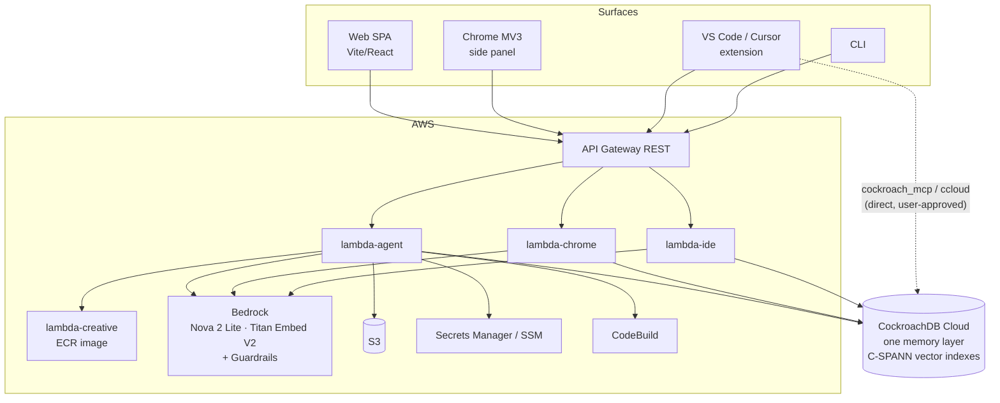

# WalkCroach — CockroachDB × AWS Hackathon Submission

**Track:** Build with Agentic Memory · **Deadline:** 2026-08-18 · **Drafted:** 2026-08-01

> **Status: DRAFT.** Every claim below is verified against the code or the live cluster
> unless it is marked `TODO`. Anything still `TODO` is an open gate, not a soft spot —
> do not submit with them unresolved. Nothing here may be softened into a claim the
> code does not support; see [`web-claims-audit.md`](./web-claims-audit.md) for the
> same rule applied to product copy.

---

## 0. Submission checklist

| Required | Status |
|---|---|
| Public repo URL | ✅ `https://github.com/Tolu-Orina/walkcroach` — **TODO: confirm public** |
| Installable artifacts | ✅ [`@walkcroach/cli@0.3.0`](https://www.npmjs.com/package/@walkcroach/cli) on npm **with SLSA provenance**; [`walkcroach.walkcroach-ide@0.2.0`](https://open-vsx.org/extension/walkcroach/walkcroach-ide) on Open VSX |
| Open-source licence detectable in About | ✅ MIT, [`LICENSE`](../LICENSE) at repo root |
| README with setup + run instructions | ✅ [`README.md`](../README.md) — verified by following it from scratch |
| Dependencies / example config | ✅ per-module `package.json`; [`.env.example`](../.env.example) |
| **Functional demo app URL** | ❌ **TODO** — see §7 |
| **Video < 3 min, public on YouTube/Vimeo** | ❌ **TODO** — script in §6 |
| Which CockroachDB tools, and what the agent did with them | ✅ §2 |
| Which AWS services, and how | ✅ §3 |
| Architecture diagram *(optional)* | ✅ §4 |
| Feedback on CockroachDB AI tools *(optional)* | ✅ §8 — we have a substantive finding |

---

## 1. What WalkCroach is

An agentic platform where **one CockroachDB memory layer is shared across four
surfaces**: a web app-builder, a Chrome side-panel copilot, a VS Code / Cursor
extension, and a CLI.

The thesis: an agent loop cannot build coherently without recalling what it already
decided. A decision made in the browser has to be available to the agent in your
editor, and a preference stated in the CLI has to survive into next week's session.
That is not a cache — it is a system of record, and it is the thing that makes the
agent useful past the first conversation.

Every memory row carries `source_surface`, so recall is genuinely cross-surface
rather than four private stores behind one brand. This is covered by an integration
test that creates a Web project, links an IDE repo key, mirrors a decision, and
recalls it from the other side:
[`tests/integration/cross-surface.integration.test.ts`](../tests/integration/cross-surface.integration.test.ts).

**Scope honesty:** four surfaces ship. The sibling `walkcroach-desktop/` is
postponed scaffolding and is **not** a fifth surface — do not present it as one.

---

## 2. CockroachDB tools used

All four listed tools are used, each with a real job. Details and file references

### 2.1 Cloud Managed MCP Server

- **Where:** [`packages/agent-engine/src/mcp.ts`](../packages/agent-engine/src/mcp.ts)
  (IDE/CLI, in the extension host) and
  [`infra-backend/packages/agent-harness/src/mcp.ts`](../infra-backend/packages/agent-harness/src/mcp.ts)
  (Web/Chrome, in Lambda).
- **How:** Streamable-HTTP MCP client against `https://cockroachlabs.cloud/mcp`,
  authenticated with a service-account Bearer key plus the `mcp-cluster-id` header.
  Credentials live in VS Code `SecretStorage` / Lambda env, never in workspace files.
  Configured by pasting the Cloud Console snippet — `parseMcpConfigSnippet` accepts
  both the `{ mcpServers: {...} }` and bare `{ url, headers }` shapes.
- **What the agent actually does with it:** exposed to the model as the
  `cockroach_mcp` tool, so the agent inspects live schema before writing SQL or DDL
  rather than guessing from stale training data — `list_tables`, `get_table_schema`,
  `explain_query`, `show_running_queries`, read-only `select_query`.
- **Safety:** a strict allowlist of eight known read-only tool names. Everything
  else — including any unrecognised name — is treated as a write and requires
  explicit per-call user consent (`isMcpWriteTool`). `cockroach_mcp` can **never**
  be auto-approved at any autonomy level
  ([`approvals.ts:77,131`](../packages/agent-engine/src/approvals.ts)), and MCP
  writes are refused outright in read-only sub-agent mode. Errors are mapped to
  plain remediation text instead of raw stack traces (`plainMcpError`).
- **stdio-spawned MCP servers, off by default (2026-08-01).** Supporting these means
  reading a file out of a cloned repository and executing the program it names — the
  same class of vulnerability as VS Code task auto-run. It was deferred, threat-modelled
  in [`walkcroach-stdio-mcp-security-review.md`](./walkcroach-stdio-mcp-security-review.md),
  then implemented against every mitigation that review demanded: per-command consent
  recorded against a fingerprint and revocable, an environment stripped of every
  credential *even when explicitly allow-listed*, commands resolved to an absolute path
  and refused if they resolve inside the workspace, `server__tool` namespacing, and one
  supervisor owning process-tree kill at window close.

  Two details worth the judges' attention. First, **the enabling setting's location is
  the actual gate** — it is contributed with VS Code's `"scope": "machine"` and read
  from user-level CLI config only, deliberately inverting that module's normal
  `project > user` precedence, because a workspace-readable flag would let a repository
  authorise its own execution. Second, **registration happens during agent-loop setup,
  not at workspace open**, so a user prompt always precedes it and consent has a turn to
  attach to. Opening a folder still spawns nothing.

  The review's own §7 test bar is `packages/agent-engine/src/mcp-stdio.test.ts` (44
  tests, `describe` blocks labelled T1–T7 against its bullets), verified against
  deliberate mutations of each gate.

### 2.2 Distributed Vector Indexing

- **Shape:** `VECTOR(1024)` columns embedded with Amazon Titan Embeddings V2, across
  seven tables — `memory_entries`, `project_documents`, `project_document_chunks`,
  `page_captures`, `creative_assets`, `workflow_runs`, `video_jobs`.
- **Retrieval:** cosine distance (`<=>`) with tenant-scoped filters, over C-SPANN
  indexes prefixed on the tenant column.
- **This is where our most interesting engineering happened — see §5.** Short
  version: the indexes were inert for the project's entire history, we found it, and
  we fixed it in migrations `026`–`029`.

Current index shapes, read back from the live cluster after migrating:

| Table | Vector index | Tenant prefix |
|---|---|---|
| `memory_entries` | `(project_id, embedding vector_cosine_ops)` | project |
| `project_documents` | `(project_id, embedding vector_cosine_ops)` | project |
| `project_document_chunks` | `(project_id, embedding vector_cosine_ops)` | project |
| `creative_assets` | `(owner_id, embedding vector_cosine_ops)` | owner |
| `page_captures` | `(owner_id, embedding vector_cosine_ops)` | owner |
| `workflow_runs` | `(owner_id, embedding vector_cosine_ops)` | owner |
| `video_jobs` | `(owner_id, embedding vector_cosine_ops)` | owner |

The prefix column is not uniform because the tenant key is not uniform: General Chat
creatives have no project, so `creative_assets` recall keys on `owner_id`. Each index
is prefixed on the column its *actual reader* constrains, which we checked query by
query rather than assuming.

### 2.3 ccloud CLI

- **Where:** [`packages/agent-engine/src/ccloud.ts`](../packages/agent-engine/src/ccloud.ts),
  surfaced as the `ccloud` tool.
- **How:** spawned with `shell: false` (no shell injection surface), output forced to
  `-o json` via `ensureJsonOutput` so the agent parses structured data instead of
  scraping human-formatted text, API key injected through the environment.
- **What the agent does with it:** CockroachDB Cloud control-plane work the MCP
  server does not cover — cluster listing and lifecycle during setup and operations.
- **Safety:** **never** auto-approved, at any autonomy level
  ([`approvals.ts:130`](../packages/agent-engine/src/approvals.ts)). The user sees the
  exact command string before it runs. `isCcloudInfraAction` additionally flags
  provisioning/destructive verbs (`create`, `delete`, `restore`, …) for hard gating,
  and `ccloud` is in the critical-command regex alongside `terraform` and `kubectl`.

### 2.4 Agent Skills

- **Where:** [`packages/agent-engine/src/skills/cockroachdb-official.generated.json`](../packages/agent-engine/src/skills/cockroachdb-official.generated.json).
- **How:** **34 official skills** vendored from the open-source
  `cockroachlabs/cockroachdb-skills` repo (Apache-2.0, attributed) — transaction
  design, multi-region, `cockroachdb-sql`, range distribution, statement/transaction
  fingerprint profiling, MOLT, cluster ops, and the full security set (CIS benchmark,
  CMEK, audit logging, IP allowlists, SSO/SCIM, TLS).
- **What the agent does with them:** loaded progressively via `load_skill` rather than
  pasted into the system prompt, so the catalogue costs a listing and only the needed
  body costs tokens.
- **Plus one WalkCroach-authored companion skill,** `cockroachdb-walkcroach-tools`,
  which encodes the routing decision the other three tools create: prefer `load_skill`
  for knowledge, `cockroach_mcp` for interactive read-mostly schema/data, `ccloud`
  only for Cloud lifecycle — and never auto-approve the last two.

---

## 3. AWS services used

| Service | How it is used |
|---|---|
| **Amazon Bedrock** | Nova 2 Lite via the Converse streaming API is the agent loop's model on every surface. **Titan Embeddings V2** produces every 1024-d vector written to CockroachDB. Nova Canvas / Reel drive the creative paths. |
| **Bedrock Guardrails** | `aws_bedrock_guardrail` — PROMPT_ATTACK + leakage on chat, topic/content policy on creative generation. Provisioned in Terraform (`modules/bedrock-guardrails`) and wired into `lambda-agent`. |
| **AWS Lambda** | Four functions: `lambda-agent` (Web BFF + agent loop), `lambda-chrome` (extension BFF), `lambda-ide` (IDE/CLI BFF), `lambda-creative` (container image, document/image composition). |
| **API Gateway (REST)** | Fronts all four Lambdas; agent responses stream via `streamifyResponse`. |
| **Amazon S3** | Artefacts bucket, generated-app hosting bucket, Chrome page-capture bucket — all with public access blocked, SSE, and versioning. |
| **Amazon Cognito** | One user pool and one SPA client shared by all four surfaces; IDE/CLI authenticate by PKCE against Web's client rather than a second pool. |
| **AWS Secrets Manager / SSM Parameter Store** | Connector OAuth tokens, Stripe keys, CockroachDB connection string; SSM carries build-time config into CodeBuild. |
| **AWS CodeBuild / CodePipeline** | One-click deploy of user-generated apps, plus the CI/CD pipelines for backend and web. |
| **AWS Step Functions** | Optional long-running video-generation poller (conditional; see §7). |
| **Amazon ECR** | Container image for the creative Lambda. |
| **CloudFront + ACM + Route 53** | SPA and generated-app delivery, incl. the COOP/COEP headers WebContainer needs. |
| **CloudWatch (Logs, EMF, Dashboards) + SNS + AWS Budgets** | Two Embedded Metric Format namespaces — `WalkCroach/Creative` and `WalkCroach/Memory` (new, see §5.4) — plus a Bedrock spend budget with SNS alerting. |

---

## 4. Architecture



Two things worth pointing at in the diagram:

1. **Every surface writes to the same CockroachDB**, tagged by `source_surface`.
   That single arrow convergence is the whole submission.
2. **The IDE/CLI path to CockroachDB is direct**, not proxied through our Lambda.
   The Managed MCP server and `ccloud` run against the user's own cluster with the
   user's own service-account key. We never hold those credentials, which is why
   both paths are hard-gated behind explicit approval.

---

## 5. Agentic memory design — the substance

### 5.1 What is stored

`memory_entries` is the spine: `project_id`, `source_surface`, `kind`
(`preference` | `decision` | `capture`), `text`, `embedding VECTOR(1024)`,
`superseded_by`. Around it, across **29 migrations**, sit sessions and messages,
project/stack config, checkpoints, tool invocations, build events, RAG documents and
chunks, page captures, workflow runs, credit ledger, and per-surface auth/link tables.

This is transactional operational data and embeddings **in the same database** —
no separate vector store, no sync job, no consistency gap between "what the agent
decided" and "what the agent can find."

### 5.2 How memory enters the loop

Recall is not a tool the model has to remember to call. Before each turn the harness
recalls against the user's message and injects the hits into the system prompt
(`agent-harness/src/loop.ts`), and emits a `memory_recalled` NDJSON event so the UI
can show *what was remembered and from which surface* — `MemoryRecallCard` in Web,
`RecallSources` in the Chrome side panel. Memory is visible to the user, not a hidden
prompt trick. The model additionally has `recall_project_memory` and
`remember_preference` for explicit use.

### 5.3 Memory has a lifecycle, not just an append path

`superseded_by` existed in the schema from migration 001 and was read by every recall
query — and **written by nothing**. Memory was append-only: restate a preference three
times and all three came back as context, with no signal about which was current.

`writeMemoryEntryDetailed` now retires the nearest same-kind entry when a new one
restates it, using the vector index to find the neighbour. The read-nearest / insert /
mark-superseded sequence runs in one transaction so concurrent writes cannot leave two
entries both claiming to be current, and the Bedrock embed call is issued *before* the
transaction because a serialization retry would otherwise re-bill it.

The threshold is deliberately tight (cosine 0.15, `MEMORY_SUPERSEDE_THRESHOLD`). It
collapses restatements; it will not catch a lexically-distant contradiction like
"use Postgres" → "use MySQL". That is the intended failure direction: keeping a stale
entry is recoverable, silently retiring one the user still relies on is not. Widening
it wants eval data, not a bigger constant.

Superseding also forced a second fix: `superseded_by IS NULL` is applied *after* the
approximate-nearest-neighbour search, so a bare `LIMIT k` starts under-returning the
moment retired rows exist. Recall now over-fetches 4× and slices.

### 5.4 Memory is observable

New EMF namespace **`WalkCroach/Memory`**: recall latency, hit count, top-distance,
empty-recall count, writes, supersedes, embed latency, embed failures. Dimensioned by
`surface` and `operation` only — identifiers ride along as log fields so a project
stays traceable in Logs Insights without exploding metric cardinality. Instrumentation
can never break recall: the metric path is individually try/caught.

Before this, the only instrumented subsystem was Creative — the memory layer that the
whole product rests on had no signal at all.

### 5.5 The finding: our vector indexes had never once been used

This is the part worth reading.

The stack looked right. Correct `VECTOR(1024)` columns, `CREATE VECTOR INDEX` in the
migrations, cosine recall queries, tenant filters, passing tests, real embeddings from
Titan. It also **returned correct results**, which is exactly why nobody noticed.

Two independent defects were stacked:

1. **No prefix column.** Every index was declared on `embedding` alone, while every
   recall query constrains a tenant column first. CockroachDB uses a vector index
   under a filter only when *each* prefix column is constrained to a specific value.
2. **Wrong operator class.** Every index took the default **`vector_l2_ops`**, which
   accelerates only `<->`. Every recall query in the codebase measures cosine
   distance with `<=>`. An opclass mismatch makes the index **ineligible outright** —
   no prefix shape can rescue it.

Fixing only the first was not enough, and the cluster said so plainly:

```
index "memory_entries_project_embedding_idx" cannot be used for this query
```

Migrations `026`/`027` add the tenant prefix; `028`/`029` rebuild with
`vector_cosine_ops`. Each pair is split drop-then-create across two files because
`migrate.ts` runs each file as a single transaction.

**Evidence, from the live cluster.** Before — the planner ignores the vector index,
scans the B-tree, index-joins, and does an exact top-k:

```
• top-k  (order: +distance, k: 20)
└── • filter
    └── • index join   table: memory_entries@memory_entries_pkey
        └── • scan     table: memory_entries@memory_entries_project_id_idx
```

After, with the index hinted to demonstrate eligibility:

```
• top-k  (order: +distance, k: 20)
└── • lookup join   table: memory_entries@memory_entries_pkey
    └── • vector search
          table: memory_entries@memory_entries_project_embedding_idx
          target count: 20
          prefix spans: [/'3d4397ca-f9b8-4e0f-a167-346f3b7cd5b8']
```

`• vector search` with `prefix spans` pruning by tenant — both fixes doing their job.

> **Do not overclaim this.** The *unhinted* plan on our current data still scans,
> because `memory_entries` holds 9 rows and scanning 2 of them is genuinely cheaper
> than an ANN lookup. The optimizer is right. The honest claim is
> **ineligible → eligible**, evidenced by the error message and the `vector search`
> node. Showing the unhinted before/after side by side would imply a speedup that is
> not there, and a Cockroach Labs judge will spot it instantly.
> **TODO:** to demonstrate the index *winning*, seed a throwaway table with a few
> thousand vectors, EXPLAIN both index shapes, drop it. Then the numbers are real.

The transferable lesson, and the reason this belongs in the write-up: a vector layer
can be completely inert while every test passes and every answer is correct, because
brute-force scan and ANN lookup differ in cost, not in output. Correctness testing
cannot detect it. Only reading the plan can.

### 5.6 Production posture of the memory layer

Fixed in the same pass, all verified against the live cluster:

- **TLS verification was disabled.** `db/client.ts` passed `rejectUnauthorized: false`,
  silently downgrading every connection to unverified TLS while `.env.example`
  documented `sslmode=verify-full`. Now verified by default, with `CRDB_CA_CERT` for
  custom CAs and a loud, explicit `CRDB_SSL_INSECURE` escape hatch. Confirmed against
  CockroachDB Cloud with no CA cert required.
- **No serialization retry.** CockroachDB defaults to SERIALIZABLE; `db.query` and
  `db.withTransaction` now retry SQLSTATE `40001` with full-jitter exponential
  backoff. Ambiguous connection errors (`08006`, `57P01`, `ECONNRESET`) are
  deliberately **not** retried — they may have committed, and replaying a credit
  debit would double-apply it.
- **A transaction that was not a transaction.** The Chrome anonymous→Cognito account
  merge ran `db.query('BEGIN')` against a *pool*, so each statement took an arbitrary
  connection: the BEGIN opened a transaction that was never committed while the
  UPDATEs autocommitted separately. A partial failure would migrate a user's
  workspaces but strand their `page_captures` under a dead `owner_id`, orphaning that
  memory permanently. Now a real transaction — and `db.query` refuses transaction
  control outright so the bug class cannot recur.
- **Ledger audit drift.** `debitCredits` updated the balance and inserted its audit
  row as two statements; a crash between them spent credits with no ledger entry.
  Now one transaction.
- **`application_name`** per surface, so the DB Console's fingerprint views answer
  "which surface is driving this load" directly.

### 5.7 The loop is tested, and the tests are verified to bite

`loop.ts` is the widest-blast-radius file in the backend — every Web and Chrome turn
runs through it — and it had no dedicated suite. `loop.test.ts` now covers 45 cases
across four areas that would be expensive to regress:

- **Memory recall** — that recall happens *before* the model call rather than after,
  is scoped to the project, produces a `memory_recalled` event with correct
  count/kind-dedup/5-hit cap/280-char truncation, and that the recalled text actually
  lands in the system prompt the model receives.
- **Session state machine** — unknown session, project mismatch, `awaiting_tool`,
  `awaiting_plan_approval`, `running`, and a lost turn claim are each refused without
  reaching Bedrock; the claim is always released, including when the model throws.
- **Mode escalation** — the full stored×requested matrix for `resolveEffectiveMode`,
  plus an end-to-end check that a chat session handed `mode: 'build'` by the client
  still receives no `write_file` / `edit_file` / `run_terminal` tools.
- **Termination** — clean completion, guardrail short-circuit, `MAX_INNER_TURNS`
  exhaustion, and model failure surfacing a user-safe message while the AWS ARN and
  model id stay in server logs only.

`tools.ts`, `tool-loop-guard.ts` and `attachment-content.ts` are deliberately left
**unmocked** — they are pure with no runtime imports, so mode→tool wiring is genuinely
exercised rather than stubbed into agreement.

**These tests were checked against deliberate mutations of `loop.ts`,** because a
suite that passes on first write is not yet evidence of anything:

| Mutation | Caught by |
|---|---|
| Let a chat session escalate to `build` via the client body | 5 tests, incl. the end-to-end tool-wiring check |
| Drop the memory block from the system prompt | 1 test (recall still fired; only the injection assertion failed) |
| Ignore `guardrailIntervened` and keep looping | 1 test |
| Forget to release the turn claim | 1 test |

The second one is the interesting result: recall still ran, the `memory_recalled`
event still fired, and the UI would still have shown "2 memories recalled" — while
the model received none of it. Only the assertion on the system prompt caught it.
That is exactly the failure mode a memory-first product cannot afford, and it is now
guarded.

### 5.9 Sign-in is proof-of-possession, on every surface that takes a code

WalkCroach issues its own one-time authorization code for the Web→client handoff
(`ide_auth_codes`, `chrome_auth_codes`) so a token never appears in a `vscode://`
deep link, a loopback callback, or a shell history. Until 2026-08-01 that code was
a bearer credential: whoever held it could redeem it. Two documents claimed PKCE
protected it. Neither was true — `ide/src/auth/pkce.ts` contained only
`@deprecated` stubs from a removed Hosted-UI flow, wired to nothing.

PKCE (RFC 7636, S256 only) now covers all three surfaces that receive a code:

| Surface | Code arrives on | Verifier held in |
|---|---|---|
| CLI | loopback `127.0.0.1:<port>/callback` | memory, for the life of one call |
| IDE | `vscode://…/auth` custom scheme | `SecretStorage` (survives a host restart mid-flow) |
| Chrome | `https://<id>.chromiumapp.org/auth` | `chrome.storage.session` |

Web is deliberately **not** in that table: it signs in with Cognito
`USER_PASSWORD_AUTH` and never handles an authorization code. Its three
`/connect/*` pages are a conduit — they forward the challenge and never see the
verifier, which is the property that makes the mechanism worth having.

Details worth noting:

- **`plain` is refused outright.** Under it the challenge *is* the verifier, so it
  would hand proof-of-possession to anyone who read the authorize URL.
- **Verification runs *after* the atomic consume.** The code is spent either way,
  so a wrong verifier cannot be retried against it — RFC 6749 §4.1.2's requirement,
  and what stops an intercepted code being brute-forced.
- **Every failure returns the same `invalid_grant`.** Naming the failed check would
  be a free oracle.
- **Mandatory from day one.** Because no client had shipped, there is no
  tolerate-if-absent branch anywhere — the reason PKCE was sequenced *before* the
  first publish rather than after it.
- Three separate implementations (Node in the engine, Node in the harness,
  WebCrypto in MV3) are each pinned to the **RFC 7636 Appendix B** vector, so they
  cannot silently drift apart.

The `handleCreateSessionCode` / `handleExchangeToken` pair had **no tests at all**
before this — the existing `oauth.test.ts` covered only the pure redirect-URI
predicates. 29 handler tests now cover both BFFs, verified against a mutation that
disables the check (6 fail).

### 5.10 Access control and blast radius

Single Cognito pool across surfaces; `assertProjectOwner` at the API boundary with
every recall additionally filtering `project_id`/`owner_id` in SQL, so the tenant
boundary is enforced twice. Per-project database credentials are proxied, never
handed to the client. Agent autonomy is tiered, with `ccloud`, MCP writes, shell, and
infra commands permanently outside auto-approve. Chrome threat model is written up
separately in
[`walkcroach-chrome-threat-model.md`](./walkcroach-chrome-threat-model.md).

---

## 6. Video plan (< 3 min) — TODO to record

Lead with the cross-surface moment; do not tour features.

| Time | Beat |
|---|---|
| 0:00–0:20 | The problem: agents forget across tools. Four surfaces, one memory layer. |
| 0:20–1:00 | **In Chrome:** on a real page, state a decision. Show it written to CockroachDB. |
| 1:00–1:40 | **In the IDE:** new session. Agent recalls that decision *unprompted*. Recall card shows `source_surface: chrome`. This is the whole submission. |
| 1:40–2:10 | The row in the DB Console; `EXPLAIN` showing `• vector search` with `prefix spans`. |
| 2:10–2:35 | Contradict the earlier preference → show `superseded_by` set, old entry retired. |
| 2:35–3:00 | `WalkCroach/Memory` CloudWatch dashboard; architecture diagram; close. |

---

## 7. Open gates before submitting

| # | Gate | Owner action |
|---|---|---|
| 1 | **Demo URL** | Deploy Web and seed a demo project so first-load recall has something to find. An empty demo makes the memory story invisible. |
| 2 | **Video** | Record per §6. |
| 3 | **Repo public** | Confirm public + MIT visible in the About panel. |
| 4 | **Scale evidence** | §5.5 TODO — throwaway table, real ANN-vs-scan numbers. |
| 5 | **Memory dashboard/alarms** | `WalkCroach/Memory` is emitted but nothing consumes it. `RecallEmpty` and `EmbedFailure` are the two worth alarming. |
| 6 | Video worker ARN empty; `creative_lambda_image_uri` unset | Either wire them or keep creative/video claims out of the submission. |
| 7 | Connectors + remote site profiles inert without OAuth secrets | Keep behind the claim-gating table; do not demo. |
| 8 | Chrome Web Store listing not confirmed live | Ops gate, not a judging gate. Do not claim "published" unless it is. |
| ~~9~~ | ~~CLI/IDE not published~~ | ✅ **Closed 2026-08-01.** `@walkcroach/cli@0.3.0` on npm via OIDC trusted publishing, carrying a SLSA provenance attestation; `walkcroach.walkcroach-ide@0.2.0` on Open VSX. PKCE closed the same day — see §5.9. |
| ~~10~~ | ~~`agent-harness/loop.ts` has no dedicated unit suite~~ | ✅ **Closed 2026-08-01.** `loop.test.ts` — 45 tests over memory recall, the session state machine, mode escalation, and loop termination. Mutation-verified (see §5.7). |

---

## 8. Feedback on the CockroachDB AI tools *(optional submission item)*

Offered as a user report, not a complaint — the tools are good and this is the
sharpest edge we hit.

1. **`vector_l2_ops` defaulting silently under a `<=>` workload is a trap.**
   `CREATE VECTOR INDEX ... (embedding)` succeeds, `SHOW INDEXES` lists the index, the
   query returns correct rows — and the index is never used, because the default
   opclass does not match the cosine operator. Nothing warns. Our indexes were inert
   from the day they were created and every test passed throughout. Suggestions, in
   order of value: a notice at `CREATE VECTOR INDEX` when a table's only vector
   queries use a different operator; surfacing "index ineligible: opclass mismatch" in
   `EXPLAIN` output rather than only on an explicit hint; or an index recommendation
   in the plan, the way the optimizer already recommends B-tree replacements.
2. **Prefix columns deserve louder placement.** Multi-tenant is the common case for
   agent memory, and "index acceleration with filters is only supported if the filters
   match prefix columns" is the single most important sentence in the vector-index
   docs. It reads as a detail rather than the headline.
3. **The hint-based error message was what actually diagnosed both bugs.**
   `index "..." cannot be used for this query` is excellent — precise and actionable.
   It is only reachable if you already suspect a problem and force the index. Making
   that reasoning visible without a hint would have saved the entire investigation.
4. **Managed MCP was genuinely one-snippet.** Paste from the Cloud Console, works.
   The read-only default is the right default. One ask: a documented, stable,
   machine-readable list of which tools are read-only, so clients can build an
   allowlist that does not drift — we hard-coded eight names and have to track them
   by hand.
5. **`ccloud`'s consistent noun-verb + `-o json` on every command is exactly right**
   for agent use. Forcing `-o json` and parsing structured output was trivial. More
   CLIs should be built this way.
6. **Agent Skills packaged cleanly.** 34 skills vendored and loaded progressively with
   no adaptation needed. The security set in particular is material we would not have
   written ourselves.

---

## 9. Provenance

Claims in this document are grounded in the code at the commit that adds it, plus a
live read of the CockroachDB Cloud cluster `walkcroach-29332` (eu-west-2,
CockroachDB CCL v26.2.1) on 2026-08-01. Test counts at that commit: 328
(`agent-engine`), 236 (`web`), 373 (backend workspaces), all passing.

Status source of truth: [`walkcroach-master-doc.md`](./walkcroach-master-doc.md) §7.1
lists what was closed on 2026-08-01 and what remains open.
