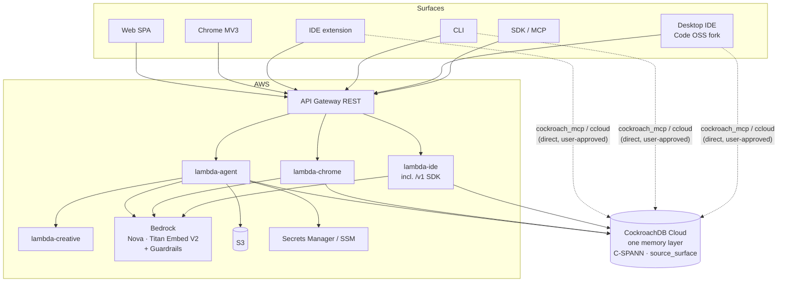

# WalkCroach: CockroachDB × AWS Hackathon Submission

**Track:** Build with Agentic Memory · **Deadline:** 2026-08-18 · **Updated:** 2026-08-10

Verified against the live code in `walkcroach/` and `walkcroach-desktop/` (not the older status docs, which lag). Claims below are either backed by source or called out as open gates.

---

## 0. Submission checklist

| Required | Status |
|---|---|
| Public repo URL | ✅ [`github.com/Tolu-Orina/walkcroach`](https://github.com/Tolu-Orina/walkcroach), public, MIT |
| Installable artifacts | ✅ **Six surfaces.** Web · Chrome extension **0.6.1** · Open VSX IDE **0.2.0** · npm CLI **0.3.0** (SLSA provenance) · SDK **0.2.0** + MCP server · Desktop IDE (Code OSS fork, builds and runs; unsigned Windows preview) |
| Open-source licence | ✅ MIT, [`LICENSE`](../LICENSE) |
| README with setup + run | ✅ [`README.md`](../README.md) |
| Dependencies / example config | ✅ per-module `package.json`; [`.env.example`](../.env.example) |
| Functional demo app URL | ✅ [`walkcroach.rinegansolutions.com`](https://walkcroach.rinegansolutions.com) |
| Video < 3 min | ❌ **TODO** (script in §6) |
| Which CockroachDB tools, and what the agent did | ✅ §2 |
| Which AWS services, and how | ✅ §3 |
| Architecture diagram *(optional)* | ✅ §4 |
| Feedback on CockroachDB AI tools *(optional)* | ✅ §8 |

---

## 1. The story: one workspace, six doors, one memory

Most agent tools forget you the moment you change apps.

You tell the browser extension "we're using Stripe, not Adyen." Ten minutes later the IDE agent invents an Adyen integration because that conversation never left the side panel. The CLI has its own history. The web builder has another. You end up copy-pasting context between tools like it's 2014 and Slack is your architecture diagram.

WalkCroach is the opposite bet.

**One CockroachDB memory layer. Six production surfaces that all read and write it.**

| Surface | What it is | How you get it |
|---|---|---|
| **Web** | App builder and creative studio | [`walkcroach.rinegansolutions.com`](https://walkcroach.rinegansolutions.com) |
| **Chrome** | Side-panel copilot on the live page | Chrome Web Store, extension **0.6.1** |
| **IDE extension** | Coding agent inside VS Code / Cursor | Open VSX `walkcroach.walkcroach-ide@0.2.0` |
| **CLI** | Same agent in the terminal | `npx @walkcroach/cli@0.3.0` |
| **SDK + MCP** | Programmatic memory + any MCP host | `@walkcroach/sdk` / `@walkcroach/sdk-mcp` **0.2.0** |
| **Desktop IDE** | Native WalkCroach editor (Code OSS fork) | Builds and runs on Windows; unsigned insider preview while we finish packaging cleanups |

A preference stated in Chrome is available to Desktop. A decision made in the CLI shows up in Web with `source_surface: cli` on the recall card. The agent is not approximating memory. It queries the same `memory_entries` table every other surface wrote into.

Those six surfaces are just doors into one workspace.

We used to say "four shipped, Desktop still compiling, SDK half-done." That was true in early August. It is not true now. Desktop compiles, packages, and runs the same `@walkcroach/agent-engine` loop as the IDE and CLI, tagged `source_surface=desktop`. The SDK can remember, recall, export, and hand the same graph to any MCP host. There is still polish left (unsigned Desktop channel, video not recorded yet). The product itself is mature.

---

## 2. CockroachDB tools used

All four listed tools do real work in the agent loop.

### 2.1 Cloud Managed MCP Server

- **Where:** [`packages/agent-engine/src/mcp.ts`](../packages/agent-engine/src/mcp.ts) (IDE / CLI / Desktop) and [`infra-backend/packages/agent-harness/src/mcp.ts`](../infra-backend/packages/agent-harness/src/mcp.ts) (Web / Chrome Lambda).
- **How:** Streamable-HTTP client against `https://cockroachlabs.cloud/mcp`, service-account Bearer + `mcp-cluster-id`. Credentials in VS Code `SecretStorage` / Desktop mirrored secrets / Lambda env. Paste the Cloud Console snippet; `parseMcpConfigSnippet` accepts both wrapper shapes.
- **What the agent does:** tool `cockroach_mcp` (`list_tables`, `get_table_schema`, `explain_query`, `show_running_queries`, read-only `select_query`). Schema inspection before SQL, not guesses from training data.
- **Safety:** eight-name read-only allowlist. Anything else needs explicit consent. `cockroach_mcp` is never auto-approved. Read-only sub-agents refuse MCP writes. Errors map to plain remediation text (`plainMcpError`).

**stdio MCP servers** exist and stay off by default. Enabling them means executing a program named by a repo file, so the gate lives at machine/user scope (not workspace-readable), registration happens during agent-loop setup (a prompt always precedes it), and workspace-resolved binaries are refused. Tests in `mcp-stdio.test.ts` cover the review bar.

### 2.2 Distributed Vector Indexing

- **Shape:** `VECTOR(1024)` from Amazon Titan Embeddings V2 across seven tables, including the spine `memory_entries`.
- **Retrieval:** cosine (`<=>`) with tenant-scoped filters over C-SPANN indexes prefixed on the tenant column.
- **The interesting part:** for most of the project's life those indexes were correctly declared and completely unused. We found it by reading `EXPLAIN`, fixed it in migrations `026` through `032`, and rewrote every recall path so the shipping query can actually hit `• vector search` with `prefix spans`. Full postmortem in §5.5.

Current `memory_entries` recall index (live cluster shape): `(project_id, superseded_by, embedding vector_cosine_ops)`.

### 2.3 ccloud CLI

- **Where:** [`packages/agent-engine/src/ccloud.ts`](../packages/agent-engine/src/ccloud.ts), tool `ccloud`.
- **How:** spawned with `shell: false`, output forced to `-o json`, API key via env.
- **What the agent does:** Cloud control-plane work MCP does not cover (cluster listing and lifecycle).
- **Safety:** never auto-approved. User sees the exact command. Destructive verbs get an extra hard gate. Present on coding hosts (IDE / CLI / Desktop); not on the cloud harness loop.

### 2.4 Agent Skills

- **34 official CockroachDB skills** vendored from `cockroachlabs/cockroachdb-skills` (Apache-2.0) into [`cockroachdb-official.generated.json`](../packages/agent-engine/src/skills/cockroachdb-official.generated.json).
- Loaded via `load_skill` so the catalogue costs a listing and only the needed body costs tokens.
- Companion skill `cockroachdb-walkcroach-tools` encodes the routing rule: prefer `load_skill` for knowledge, `cockroach_mcp` for interactive schema/data, `ccloud` only for Cloud lifecycle, and never auto-approve the last two.

---

## 3. AWS services used

| Service | How it is used |
|---|---|
| **Amazon Bedrock** | Nova (converse streaming) drives the agent on every surface. Titan Embeddings V2 produces every 1024-d vector. Nova Canvas / Reel on creative paths. Desktop/IDE/CLI use BYOK Bedrock on the host. |
| **Bedrock Guardrails** | Prompt-attack and leakage on chat; topic/content policy on creatives. Terraform `modules/bedrock-guardrails`. |
| **AWS Lambda** | `lambda-agent` (Web BFF + harness loop), `lambda-chrome`, `lambda-ide` (IDE/CLI BFF + public `/v1` SDK), `lambda-creative` (container). |
| **API Gateway (REST)** | Fronts the Lambdas; agent responses stream via `streamifyResponse`. |
| **Amazon S3** | Artefacts, generated-app hosting, page captures, desktop-release CDN bucket. |
| **Amazon Cognito** | One user pool shared across surfaces. Web: `USER_PASSWORD_AUTH`. IDE / CLI / Chrome connect / Desktop: PKCE handoff codes. SDK: `wc_live_…` API keys or access token. |
| **Secrets Manager / SSM** | Connector OAuth, Stripe, CockroachDB connection string, build config. |
| **CodeBuild / CodePipeline** | Generated-app deploy + backend/web CI. |
| **Step Functions** | Optional video-generation poller. |
| **ECR** | Creative Lambda image. |
| **CloudFront + ACM + Route 53** | SPA, apps, desktop releases. |
| **CloudWatch + SNS + Budgets** | EMF namespaces `WalkCroach/Creative` and `WalkCroach/Memory`, plus Bedrock spend budget. |

---

## 4. Architecture



Two loops, on purpose:

1. **Cloud harness** (`agent-harness` in Lambda) for Web and Chrome: multi-tenant Bedrock, creatives, connectors, sandbox resume.
2. **Host-local engine** (`agent-engine`) for IDE, CLI, Desktop, and the SDK content worker: filesystem tools, worktrees, BYOK Bedrock, Managed MCP, ccloud.

Both write the same CockroachDB memory. Provenance values: `web | chrome | ide | cli | desktop | sdk` ([`memory-contracts/src/surfaces.ts`](../packages/memory-contracts/src/surfaces.ts)).

IDE / CLI / Desktop talk to the user's own Cockroach Cloud cluster for MCP and ccloud with the user's own key. We never hold those credentials. That is why both paths stay behind explicit approval.

---

## 5. Agentic memory design: the substance

### 5.1 What is stored

`memory_entries` is the spine: `project_id`, `source_surface`, `kind` (`preference` | `decision` | `capture`), `text`, `embedding VECTOR(1024)`, `superseded_by`. Around it sit sessions, checkpoints, RAG chunks, page captures, workflow runs, credit ledger, auth-link tables, governance/erase columns, and portability export.

Transactional operational data and embeddings live in **the same database**. No separate vector store. No sync job. No consistency gap between "what the agent decided" and "what the agent can find."

### 5.2 How memory enters the loop

Recall is not a tool the model has to remember to call. Before each turn the harness recalls against the user's message and injects hits into the system prompt, then emits a `memory_recalled` event so the UI can show *what was remembered and from which surface*. Memory is visible, not a hidden prompt trick. The model also has `recall_project_memory` and `remember_preference` for explicit use.

Coding hosts (IDE / CLI / Desktop) use the same graph through `ProjectMemoryBridge` → `/v1/memory/*`, with the surface tag set per host.

### 5.3 Memory has a lifecycle

`superseded_by` existed in the schema from migration 001 and was read by every recall query, and written by nothing. Restate a preference three times and all three came back.

`writeMemoryEntryDetailed` now retires the nearest same-kind entry when a new one restates it, using the vector index inside one transaction. The Bedrock embed runs *before* the transaction so a serialization retry does not re-bill it.

Threshold is tight (cosine 0.15). It collapses restatements. It will not silently retire a lexically distant contradiction. That failure direction is intentional: keeping a stale entry is recoverable; quietly dropping one the user still relies on is not.

Recall over-fetches and filters, because `superseded_by IS NULL` applied after ANN would under-return once retired rows exist.

### 5.4 Memory is observable

EMF namespace **`WalkCroach/Memory`**: recall latency, hit count, top-distance, empty recalls, writes, supersedes, embed latency, embed failures. Dimensioned by `surface` and `operation`. Metric path is try/caught so instrumentation cannot break recall. Dashboard and alarms live in `modules/observability-memory`.

### 5.5 The finding: our vector indexes had never once been used

This is the part worth reading.

The stack looked right. Correct `VECTOR(1024)` columns, `CREATE VECTOR INDEX` in the migrations, cosine recall queries, tenant filters, passing tests, real Titan embeddings. It also **returned correct results**, which is exactly why nobody noticed.

Two defects were stacked:

1. **No prefix column.** Indexes were on `embedding` alone while every recall query constrains a tenant column first. CockroachDB uses a vector index under a filter only when each prefix column is pinned to a specific value.
2. **Wrong operator class.** Indexes defaulted to `vector_l2_ops` (accelerates `<->`). Every recall query uses cosine `<=>`. Opclass mismatch makes the index ineligible outright.

Fixing only the first was not enough:

```
index "memory_entries_project_embedding_idx" cannot be used for this query
```

Migrations `026`/`027` add the tenant prefix; `028`/`029` rebuild with `vector_cosine_ops`.

**Evidence from the live cluster.** Before: planner scans a B-tree, index-joins, exact top-k. After:

```
• top-k  (order: +distance, k: 20)
└── • lookup join   table: memory_entries@memory_entries_pkey
    └── • vector search
          table: memory_entries@memory_entries_project_embedding_idx
          target count: 20
          prefix spans: [/'3d4397ca-f9b8-4e0f-a167-346f3b7cd5b8']
```

**Then a third defect, which only measuring found.**

CockroachDB refuses a vector index for any query with a predicate on a column outside the index prefix. Our shipping queries carried `superseded_by IS NULL`, status filters, joins. After migrations `026` through `029` the indexes were correctly shaped and still unused on the real path.

Fixed in `031`/`032` plus a rewrite of all recall paths: always-present filters moved into the prefix, optional filters (`source_surface`, `kind`) applied over the over-fetched candidate set, chunk search moved into a CTE so its join no longer constrains the indexed table. Verified accepted against the live cluster.

`memory.test.ts` asserts the WHERE clause contains exactly the prefix columns and nothing else. That is the guard that would have caught this on day one.

We deliberately do not claim a speedup number. At tiny row counts the optimizer correctly prefers a scan. The claim is narrower and checkable: **the shipping queries can now use their indexes, and could not before.**

The transferable lesson: a vector layer can be completely inert while every test passes and every answer is correct, because brute-force scan and ANN differ in cost, not in output. Correctness testing cannot detect it. Only reading the plan can.

### 5.6 Production posture of the memory layer

Fixed in the same pass, verified against the live cluster:

- **TLS verification on by default** (`rejectUnauthorized: true`), with `CRDB_CA_CERT` and an explicit `CRDB_SSL_INSECURE` escape hatch.
- **Serialization retry** for SQLSTATE `40001` with full-jitter backoff. Ambiguous connection errors are *not* retried (they may have committed; replaying a credit debit would double-apply).
- **Real transactions** for Chrome anonymous→Cognito merge and credit ledger debit+audit (previously pool-`BEGIN` / two-statement drift).
- **`application_name` per surface** so DB Console fingerprints answer which surface is driving load.
- **Governance / erase** columns and portability export (`walkcroach-memory-export/1.0`) that preserve supersede links and the embedding model id.

### 5.7 The loop is tested, and the tests bite

`loop.test.ts` covers memory recall *before* the model call, session state machine refusals, mode escalation (a chat session cannot escalate to build tools via the client body), and termination paths. Mutations of `loop.ts` were used to verify the suite catches real failures, including the nasty one where recall still fires a UI event while the system prompt receives nothing.

Cross-surface integration tests create a Web project, link other surfaces, mirror a decision, and recall it from the other side (`tests/integration/cross-surface*.integration.test.ts`), including Desktop and SDK surface tags.

### 5.8 Sign-in is proof-of-possession where a code is involved

WalkCroach issues its own one-time authorization code for Web→client handoff so a token never appears in a deep link, loopback callback, or shell history. PKCE (S256 only) covers CLI, IDE, Chrome connect, and Desktop (same `/connect/ide` path as the extension). Web SPA login itself uses Cognito password auth and never handles that code. `plain` is refused. Verification runs after atomic consume. Failures return the same `invalid_grant`.

### 5.9 Access control and blast radius

Single Cognito pool across surfaces; `assertProjectOwner` at the API boundary with every recall also filtering `project_id` / `owner_id` in SQL. Agent autonomy is tiered. `ccloud`, MCP writes, shell, and infra commands stay outside auto-approve. Desktop trust gate blocks tools on untrusted folders.

### 5.10 The memory layer is a product: SDK + MCP

`@walkcroach/sdk` is a typed client for the memory layer: `remember` / `recall` / `list` / `forget`, plus `asOf()` and `diff()` on `AS OF SYSTEM TIME`. `project_id` is required on every read so an unscoped recall (which would bypass the tenant-prefixed C-SPANN index) cannot be expressed.

`@walkcroach/sdk-mcp` implements the **2026-07-28** MCP revision and exposes the same memory to Claude Code, Cursor, or any compliant host. That is a seventh *client shape* we did not have to build as a first-party UI.

Point-in-time search was checked against the live cluster: the vector index still plans under `AS OF SYSTEM TIME`. Retention on `memory_entries` is ~25 hours (`gc.ttlseconds = 90000` via migration `034`). That window is a product constraint we disclose, not a multi-year archive claim.

Export/import preserves the supersede chain. Cross-tenant reads refuse with 404 (not 403). API keys cannot mint other keys.

Content publish on the IDE Lambda runs `@walkcroach/sdk-host` → `agent-engine` for programmatic agent work. The public npm surface is the memory/content API; the coding `HostAdapter` stays private with the engine.

---

## 6. Six surfaces, one demo story

Lead with cross-surface memory. Do not tour features.

| Time | Beat |
|---|---|
| 0:00-0:20 | The problem: agents forget when you change tools. Six doors, one memory. |
| 0:20-0:55 | **Chrome:** on a real page, state a decision. Show it written. |
| 0:55-1:35 | **Desktop IDE** (or IDE extension): new session. Agent recalls that decision unprompted. Recall card shows `source_surface: chrome`. |
| 1:35-2:05 | Row in the DB Console; `EXPLAIN` showing `• vector search` with `prefix spans`. |
| 2:05-2:30 | Contradict the preference: `superseded_by` set, old entry retired. |
| 2:30-3:00 | Optional: CLI or SDK/MCP echo of the same row; Memory CloudWatch dashboard; close. |

Desktop is fair game for the video: the Windows package builds and runs (`WalkCroach.exe`, Code OSS pin **1.131.0**, Path B Agents Window, Agent Host provider `walkcroach`). Say "unsigned preview build" once if you show the installer; do not imply a signed store listing.

---

## 7. Open gates before submitting

| # | Gate | Notes |
|---|---|---|
| 1 | **Video** | Record per §6. Seed a demo project first so first-load recall has something to find. |
| 2 | Demo project seed | Cluster seed data can be stale; rehearse the contradict→supersede beat before recording. |
| 3 | Desktop distribution | Production-grade product surface; **unsigned** Windows insider/portable channel. Signing, SmartScreen, and first public `desktop-v*` Release are still in flight. Honest wording only. |
| 4 | Creative / video image | Wiring exists; until the creative Lambda image is pushed and applied, do not claim live Reel video in the demo. |
| 5 | asOf window | ~25h MVCC retention on `memory_entries`. Fine for demos; do not imply multi-week time travel. |
| ~~6~~ | ~~Desktop "never compiled"~~ | ✅ **Closed.** Fork builds, packages, and runs; memory tagged `desktop`. |
| ~~7~~ | ~~Four-surfaces-only framing~~ | ✅ **Closed.** Six surfaces are the honest product map. |
| ~~8~~ | ~~Vector indexes inert~~ | ✅ Closed 2026-08-01 (migrations `026` through `032`). |
| ~~9~~ | ~~CLI / IDE publish~~ | ✅ `@walkcroach/cli@0.3.0`, Open VSX IDE `0.2.0`. |
| ~~10~~ | ~~Chrome store path~~ | ✅ Extension **0.6.1**, tag-driven publish workflow. |
| ~~11~~ | ~~SDK / MCP~~ | ✅ Packages at **0.2.0** with live-cluster verification on tenant, scope, portability, and asOf planning. |

---

## 8. Feedback on the CockroachDB AI tools *(optional)*

Offered as a user report. The tools are good; this is the sharpest edge we hit.

1. **`vector_l2_ops` defaulting under a `<=>` workload is a trap.** `CREATE VECTOR INDEX` succeeds, `SHOW INDEXES` lists it, queries return correct rows, and the index is never used. Nothing warns. Suggestions: notice at create time when the table's vector queries use a different operator; surface "index ineligible: opclass mismatch" in `EXPLAIN` without requiring a hint; or recommend the matching index the way the optimizer already recommends B-trees.
2. **Prefix columns deserve louder placement.** Multi-tenant agent memory is the common case. "Index acceleration with filters only works when filters match prefix columns" should read as the headline, not a detail.
3. **The hint-based error was what diagnosed both bugs.** `index "..." cannot be used for this query` is precise. Making that reasoning visible without a hint would have saved the investigation.
4. **Managed MCP was one-snippet.** Paste from the Cloud Console, works. Read-only default is right. Ask: a stable machine-readable list of which tools are read-only so client allowlists do not drift by hand.
5. **`ccloud`'s noun-verb + `-o json` is exactly right for agents.** Forcing JSON and parsing structured output was trivial.
6. **Agent Skills packaged cleanly.** 34 skills vendored and loaded progressively with no adaptation. The security set is material we would not have written ourselves.

---

## 9. Provenance

Grounded in:

- `walkcroach/` packages, Lambdas, migrations, and integration tests as of **2026-08-10**
- `walkcroach-desktop/` product pin **VS Code / Code OSS 1.131.0**, Agent Host provider, Path B Agents Window, packaged `WalkCroach.exe` present on the operator machine
- Live CockroachDB Cloud cluster used for the vector-index and asOf investigations (eu-west-2)

Older claims that Desktop "has never fully compiled" or that only four surfaces may be demoed are **superseded** by this revision. Distribution channel honesty (unsigned Desktop preview) remains.
