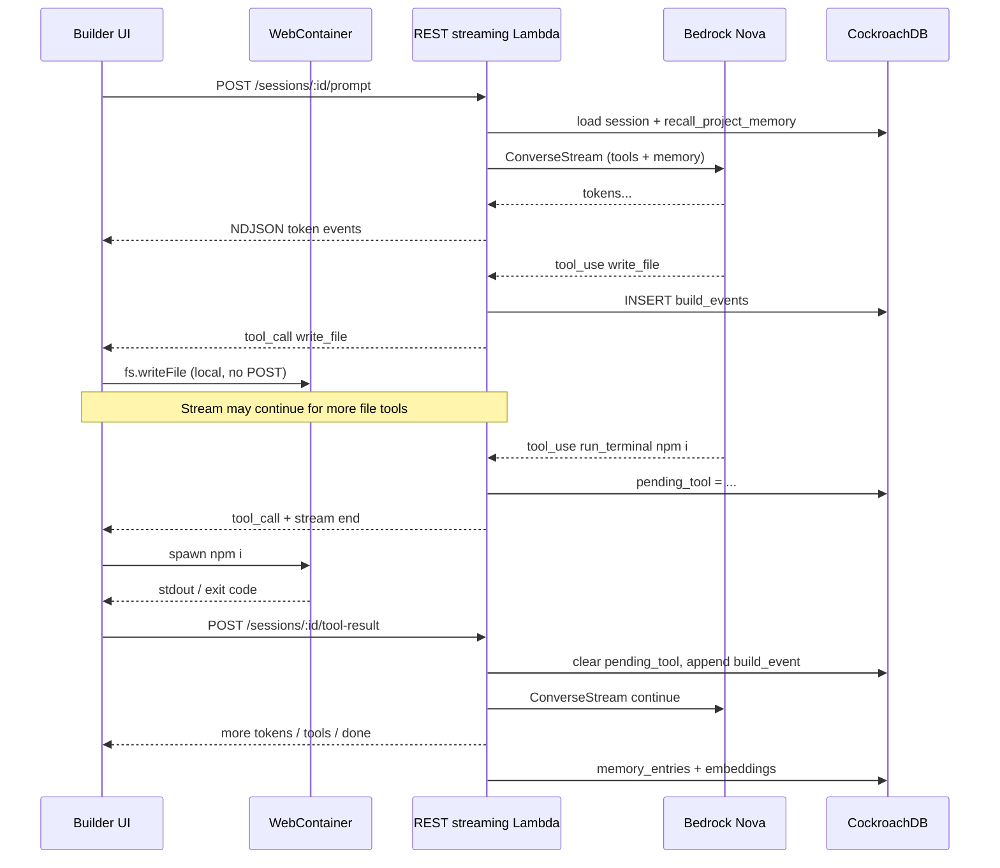

# WalkCroach Web — Implementation Plan

**Status:** Ready to implement  
**Flagship surface:** Module 1 — WalkCroach Web (prompt-to-app builder)  
**Hackathon:** CockroachDB × AWS — Build with Agentic Memory (deadline Aug 18, 2026)  
**Last updated:** July 2026

---

## 0. One-sentence thesis

> WalkCroach Web is a codegen agent that cannot build coherently without recalling what it already decided — and every decision lives in CockroachDB before the session ends.

The WebContainer preview is the **surface**. CockroachDB is the **product**. AWS Lambda + Bedrock is the **runtime**.

---

## 1. Hackathon alignment

| Requirement | How WalkCroach Web meets it |
|-------------|----------------------------|
| Agentic app that stores / retrieves / acts on memory | Agent loop recalls C-SPANN memory before every turn; writes `build_events` + `memory_entries` on every tool step |
| CockroachDB as persistent memory | Conversation, preferences, task state, embeddings, transactional build log — all in CRDB |
| Deployed on AWS | Lambda + API Gateway REST (streaming) + S3/CloudFront |
| ≥2 CockroachDB tools | Managed MCP Server + C-SPANN Vector Index (+ ccloud CLI in CI, Agent Skills in harness) |
| ≥1 AWS service | Bedrock (Nova 2 Lite + Titan Embeddings), Lambda, API Gateway, S3, CloudWatch |
| Demo video shows memory at work | Session 1 stores preference → Session 2 recalls it without re-prompting |

### Memory types → tables

| Hackathon memory type | Table / mechanism | When written |
|----------------------|-------------------|--------------|
| Conversation history | `sessions`, `messages` | Every plan/build turn |
| User context | `projects.stack_config`, `memory_entries` (kind=preference) | Project create + inferred from prompts |
| Task state | `sessions.pending_tool`, `agent_locks`, `build_events` | During active build |
| Embeddings | `memory_entries.embedding` VECTOR(1024) + C-SPANN | After decisions / preferences / captures |
| Structured transactional data | `projects`, `build_events`, `deployments` | Serializable writes per tool invocation |

---

## 2. Locked architecture decisions

These are deliberate choices for Module 1. Do not reopen unless blocked.

| Decision | Choice | Rationale |
|----------|--------|-----------|
| Compute | **Lambda** (no Fargate / App Runner for MVP) | Scales to $0 idle; fits budget |
| Agent text streaming | **API Gateway REST + Lambda response streaming** | Native Bedrock `ConverseStream` → `streamifyResponse`; TTFB; up to 15 min per invocation |
| Bidirectional transport | **None for M1** — HTTP only | Bolt.new pattern; WebSocket not required |
| Tool resume after shell | **`POST /sessions/:id/tool-result`** | Client runs `npm i` in WebContainer; server not waiting |
| Workspace execution | **WebContainer (temporary)** | In-browser Node sandbox; not durable storage |
| Durable memory | **CockroachDB Cloud** | System of record for all surfaces |
| GraphQL / AppSync | **Defer** | Resolvers cannot stream Bedrock (10s sync limit); long-running AppSync pattern = WebSocket tax with GraphQL. Revisit AppSync Events for Chrome push (Phase 5+) |
| Generated stack | React + TypeScript + Vite + Tailwind | Opinionated (Lovable/Bolt proven default) |
| Infra | Terraform: `infra-backend` + `infra-web` | Same pattern as sample pipelines + CodeConnections |
| Auth (MVP) | Simple API key / Cognito later | Ship memory loop first |

### Why not WebSocket / AppSync for Module 1

- Bolt.new streams over **HTTP SSE** and runs tools in WebContainer — production-proven for this category.
- AppSync JS Bedrock resolvers: **≤10s sync, no stream APIs**. Long-running pattern requires Lambda Event mode + subscription mutations — same complexity as raw WebSocket, more schema.
- Shell tools (`npm i`) must not hold a server connection. Client executes → `POST /tool-result` → new streaming invocation.
- 15-minute Lambda stream limit is fine for todo-sized turns and most reviews when split at shell-tool boundaries.

### Tool taxonomy (critical)

| Tool class | Examples | Where it runs | Server round-trip? |
|------------|----------|---------------|-------------------|
| **Client-local** | `write_file`, `edit_file`, `delete_file`, `read_file` (optional) | WebContainer on parse | No — execute while stream continues |
| **Client-resume** | `run_terminal`, `npm_install`, `npm_run` | WebContainer | **Yes** — stream ends with `tool_call`; client POSTs result |
| **Server-side** | `recall_project_memory`, MCP schema ops, embed + write memory | Lambda | N/A |

---

## 3. Request / agent loop



### HTTP contract

**Start / continue with prompt**

```http
POST /sessions/{sessionId}/prompt
Content-Type: application/json
Accept: application/x-ndjson

{ "message": "Build a landing page with muted tones, no salesy copy" }
```

**Stream events (NDJSON lines)**

```json
{"type":"token","text":"I'll"}
{"type":"memory_recalled","count":2,"kinds":["preference","decision"]}
{"type":"tool_call","id":"tc_1","tool":"write_file","args":{"path":"src/App.tsx","content":"..."}}
{"type":"tool_call","id":"tc_2","tool":"run_terminal","args":{"cmd":"npm install"},"awaitResult":true}
{"type":"done","reason":"awaiting_tool"}
{"type":"done","reason":"complete"}
{"type":"error","message":"..."}
```

**Resume after shell tool**

```http
POST /sessions/{sessionId}/tool-result
Content-Type: application/json
Accept: application/x-ndjson

{
  "toolCallId": "tc_2",
  "ok": true,
  "exitCode": 0,
  "stdout": "added 142 packages in 47s",
  "stderr": ""
}
```

**Other HTTP endpoints (non-streaming)**

| Method | Path | Purpose |
|--------|------|---------|
| `POST` | `/projects` | Create project |
| `GET` | `/projects/:id` | Project metadata |
| `POST` | `/sessions` | Start session for project |
| `GET` | `/sessions/:id` | Session + recent messages |
| `GET` | `/projects/:id/memory` | Debug / demo: list memory entries |
| `GET` | `/health` | Health check |

---

## 4. Repo layout

```
walkcroach/
├── web/                          # Builder SPA (React + WebContainer client)
├── infra-backend/
│   ├── packages/
│   │   ├── agent-harness/        # Bedrock loop, tools, recall, memory write
│   │   └── db/                   # Schema, migrations, SQL client
│   ├── modules/
│   │   ├── lambda-agent/
│   │   │   └── codes/            # Lambda handlers (@walkcroach/backend)
│   │   ├── apigw-rest/
│   │   ├── secrets/
│   │   ├── ssm/
│   │   └── artefacts/
│   ├── buildspec-*.yml
│   └── environments/
├── infra-web/                    # Terraform: S3, CloudFront, ACM, COOP/COEP headers
│   ├── modules/
│   ├── buildspec-*.yml
│   └── environments/
├── ci-cd/
│   ├── infra-backend-pipeline.yaml
│   └── infra-web-pipeline.yaml
├── docs/
│   └── plan1.md                  # this file
├── .env.example
└── README.md
```

**Deploy order:** `infra-backend` → SSM publishes API URL → `infra-web` build injects `VITE_API_URL`.

---

## 5. Data model (CockroachDB)

Indicative DDL — refine during Phase 0. All tables in one logical cluster.

```sql
-- projects: anchor for all memory
CREATE TABLE projects (
  id UUID PRIMARY KEY DEFAULT gen_random_uuid(),
  owner_id STRING NOT NULL,
  name STRING NOT NULL,
  surface_origin STRING NOT NULL DEFAULT 'web', -- web | chrome | ide
  stack_config JSONB NOT NULL DEFAULT '{}',
  created_at TIMESTAMPTZ NOT NULL DEFAULT now(),
  updated_at TIMESTAMPTZ NOT NULL DEFAULT now()
);

-- sessions: one agent session per surface
CREATE TABLE sessions (
  id UUID PRIMARY KEY DEFAULT gen_random_uuid(),
  project_id UUID NOT NULL REFERENCES projects(id),
  surface STRING NOT NULL DEFAULT 'web',
  model_config JSONB NOT NULL DEFAULT '{}',
  pending_tool JSONB NULL,              -- { toolCallId, tool, args, createdAt }
  status STRING NOT NULL DEFAULT 'active', -- active | awaiting_tool | complete | error
  started_at TIMESTAMPTZ NOT NULL DEFAULT now(),
  updated_at TIMESTAMPTZ NOT NULL DEFAULT now()
);

-- messages: conversation history
CREATE TABLE messages (
  id UUID PRIMARY KEY DEFAULT gen_random_uuid(),
  session_id UUID NOT NULL REFERENCES sessions(id),
  role STRING NOT NULL,                 -- user | assistant | tool
  content JSONB NOT NULL,               -- text and/or tool blocks
  created_at TIMESTAMPTZ NOT NULL DEFAULT now()
);

-- memory_entries: vectorised long-term memory (C-SPANN)
CREATE TABLE memory_entries (
  id UUID PRIMARY KEY DEFAULT gen_random_uuid(),
  project_id UUID NOT NULL REFERENCES projects(id),
  source_surface STRING NOT NULL,
  kind STRING NOT NULL,                 -- decision | preference | capture | qa
  text STRING NOT NULL,
  embedding VECTOR(1024),
  superseded_by UUID NULL,
  created_at TIMESTAMPTZ NOT NULL DEFAULT now()
);

CREATE VECTOR INDEX memory_entries_embedding_idx
  ON memory_entries (embedding)
  -- C-SPANN / cosine per CockroachDB guidance for normalised Titan V2 vectors
;

-- build_events: append-as-you-go tool log
CREATE TABLE build_events (
  id UUID PRIMARY KEY DEFAULT gen_random_uuid(),
  session_id UUID NOT NULL REFERENCES sessions(id),
  surface STRING NOT NULL DEFAULT 'web',
  tool_name STRING NOT NULL,
  tool_args JSONB NOT NULL DEFAULT '{}',
  result_summary STRING,
  created_at TIMESTAMPTZ NOT NULL DEFAULT now()
);

-- agent_locks: optional concurrent-write coordination
CREATE TABLE agent_locks (
  project_id UUID NOT NULL,
  resource_path STRING NOT NULL,
  held_by_session_id UUID NOT NULL,
  acquired_at TIMESTAMPTZ NOT NULL DEFAULT now(),
  expires_at TIMESTAMPTZ NOT NULL,
  PRIMARY KEY (project_id, resource_path)
);

-- deployments: export / static deploy history
CREATE TABLE deployments (
  id UUID PRIMARY KEY DEFAULT gen_random_uuid(),
  project_id UUID NOT NULL REFERENCES projects(id),
  target STRING NOT NULL,
  url STRING,
  status STRING NOT NULL,
  deployed_at TIMESTAMPTZ NOT NULL DEFAULT now()
);

-- page_captures: reserved for Chrome (Phase 5) — create early so schema is stable
CREATE TABLE page_captures (
  id UUID PRIMARY KEY DEFAULT gen_random_uuid(),
  project_id UUID NOT NULL REFERENCES projects(id),
  url STRING NOT NULL,
  title STRING,
  extracted_text STRING,
  screenshot_s3_key STRING,
  embedding VECTOR(1024),
  captured_at TIMESTAMPTZ NOT NULL DEFAULT now()
);
```

**Conflict / provenance:** never delete superseded memories — set `superseded_by`. Use `AS OF SYSTEM TIME` for “what did the agent believe before X?”

**Embeddings:** Amazon Titan Text Embeddings V2, 1024-dim, cosine-normalised; cosine similarity for `recall_project_memory`.

---

## 6. AWS / Terraform mapping

### `infra-backend` (agent + memory path)

| Resource | Purpose |
|----------|---------|
| API Gateway REST | Routes; `ResponseTransferMode: STREAM` on `/prompt` and `/tool-result` |
| Lambda (Node 20) | `streamifyResponse` agent handlers + thin REST API |
| Secrets Manager | CRDB connection string, MCP service-account key |
| IAM | `bedrock:InvokeModel`, `bedrock:Converse`, `bedrock:InvokeModelWithResponseStream`, Secrets read |
| S3 (artefacts) | Project export zips; future screenshots |
| SSM Parameter Store | `/walkcroach/{env}/web/api_url` |
| CloudWatch Logs | Bedrock latency, memory write failures, stream errors |

**Not in Terraform:** CockroachDB Cloud cluster (external; credentials in Secrets Manager).

### `infra-web` (static builder shell)

| Resource | Purpose |
|----------|---------|
| S3 + CloudFront | Host React SPA |
| Route53 + ACM | Demo URL (optional early; CloudFront URL OK first) |
| CloudFront response headers | **Required:** `Cross-Origin-Opener-Policy: same-origin`, `Cross-Origin-Embedder-Policy: require-corp` (WebContainer) |
| SSM reads at build | Inject `VITE_API_URL` |

Web never talks to CockroachDB directly.

### Pipeline pattern (from samples)

| Pipeline | Triggers | Flow |
|----------|----------|------|
| Backend | `infra-backend/**` | Test → TF validate → plan → approve → apply → publish SSM |
| Web | `infra-web/**`, `web/**` | Test → TF → build SPA (read SSM) → S3 sync → CF invalidate |

Adapt samples: rename `ileramed` → `walkcroach`; drop ECR/Docker for MVP (Lambda zip); add Bedrock IAM to backend CodeBuild/TF roles.

---

## 7. Phased roadmap

Each phase has **exit criteria**. Do not start the next phase until the previous exits.

---

### Phase 0 — Foundation (shared memory layer)

**Goal:** CockroachDB schema live; Bedrock reachable; shared packages exist. No UI required.

| # | Task | Owner area | Notes |
|---|------|------------|-------|
| 0.1 | Confirm CRDB cluster + MCP (already done) | Manual | Service account key in password manager |
| 0.2 | Confirm Bedrock model access (Nova 2 Lite + Titan Embeddings V2) | Manual / AWS console | Same region as Lambda |
| 0.3 | Scaffold separate npm projects (`infra-backend` packages + `web`) | Repo | no root workspace |
| 0.4 | Write migrations for Section 5 tables + vector index | `packages/db` | Apply via SQL or migration runner |
| 0.5 | CRDB SQL client helper (connection from env / Secrets) | `packages/db` | Local `.env` for now |
| 0.6 | Titan embed helper + `recall_project_memory` SQL | `packages/agent-harness` | Cosine / C-SPANN query |
| 0.7 | Bedrock `ConverseStream` wrapper (Node) | `packages/agent-harness` | Unit-testable without Lambda |
| 0.8 | `.env.example` + gitignore `.env` | Root | Document all secrets |
| 0.9 | Smoke script: insert memory → embed → recall | CLI | Proves memory path independently of UI |

**Exit criteria**

- [x] Schema applied on cluster
- [x] Smoke script recalls a known preference by semantic similarity
- [x] Bedrock returns a streamed completion locally

**Estimated effort:** 2–4 days  
**Completed:** July 2026 — `npm run smoke:memory` green

---

### Phase 1 — Agent harness (step loop, no WebContainer yet)

**Goal:** Memory-aware agent loop that streams NDJSON and supports `tool-result` resume — runnable locally or as Lambda.

| # | Task | Notes |
|---|------|-------|
| 1.1 | Tool definitions: `write_file`, `edit_file`, `run_terminal`, `recall_project_memory` | JSON schema for Bedrock toolConfig |
| 1.2 | `runPromptTurn(sessionId, message)` | Load session + recall → stream → persist messages/events |
| 1.3 | `continueAfterTool(sessionId, toolResult)` | Load `pending_tool` → continue ConverseStream |
| 1.4 | Client-local vs await-result routing | Mark shell tools with `awaitResult: true` |
| 1.5 | Persist `build_events` on every tool | Append-as-you-go |
| 1.6 | Write `memory_entries` for decisions / preferences | Heuristic or explicit “remember” tool |
| 1.7 | Plan vs Build mode flag | Plan = no file/shell tools; Build = full tools |
| 1.8 | In-memory / mock WebContainer executor for tests | Assert tool_call events without browser |

**Exit criteria**

- [x] Local CLI: prompt → stream tokens → `tool_call` → feed fake tool result → continue → `done`
- [x] CRDB shows `messages`, `build_events`, and at least one `memory_entries` row
- [x] Second session with same `project_id` recalls preference from first

**Estimated effort:** 3–5 days  
**Completed:** July 2026 — `npm run smoke:loop` green

**Harness behaviour (locked):**
- `server` tools (`recall_project_memory`, `remember_preference`) run in-process
- `client_local` tools (`write_file`, `edit_file`) emitted to client and auto-acked for Converse continuity
- `client_resume` tools (`run_terminal`) set `sessions.pending_tool` and end the stream until `POST /tool-result`

---

### Phase 2 — Lambda + API Gateway (deployed backend)

**Goal:** Agent reachable on AWS via streaming REST. Satisfies “deployed on AWS.”

**Infra baseline (July 2026):** `infra-backend/`, `infra-web/`, and `ci-cd/*-pipeline.yaml` scaffolded and `terraform validate` clean. Remaining Phase 2 work is real agent Lambda zip + deploy smoke.

| # | Task | Notes |
|---|------|-------|
| 2.1 | Lambda handlers wrapping harness (`prompt`, `toolResult`, `api`) | ✅ `streamifyResponse` router in `modules/lambda-agent/codes` |
| 2.2 | `infra-backend` Terraform modules | ✅ baseline: API GW REST, Lambda, Secrets, SSM, IAM, logs |
| 2.3 | Streaming integration URI | ✅ `2021-11-15/functions/{lambdaArn}/response-streaming-invocations` + `STREAM` |
| 2.4 | Package Lambda zip from monorepo build | ✅ `npm run package:lambda` → `.build/lambda.zip` |
| 2.5 | Wire Secrets Manager → CRDB + Bedrock region | ✅ runtime load; put real secret values in console |
| 2.6 | Deploy to **dev** (manual TF apply OK before pipeline) | Get `api_url` in SSM |
| 2.7 | curl / httpie smoke against `/health` and `/prompt` | Verify streamed NDJSON |
| 2.8 | Adapt `ci-cd/infra-backend-pipeline.yaml` | ✅ walkcroach naming; Lambda zip path (no ECR) |

**Exit criteria**

- [ ] Public HTTPS API streams NDJSON for a prompt
- [ ] `/tool-result` continues a pending session
- [ ] CloudWatch shows successful Bedrock + CRDB writes
- [ ] SSM `/walkcroach/dev/web/api_url` set

**Estimated effort:** 3–5 days

---

### Phase 3 — Builder UI + WebContainer

**Goal:** User can prompt, see live preview, agent edits files in-browser.

| # | Task | Notes |
|---|------|-------|
| 3.1 | Scaffold Vite React TS app in `web/` | ✅ Tailwind + Syne/IBM Plex |
| 3.2 | Boot WebContainer + default Vite React template | ✅ `@webcontainer/api` |
| 3.3 | Chat UI: prompt box, streamed tokens, tool chips | ✅ NDJSON client |
| 3.4 | Action runner: execute `write_file` / `edit_file` on parse | ✅ sequential queue |
| 3.5 | Shell tools: run in WC → `POST /tool-result` | ✅ + terminal panel |
| 3.6 | Live preview iframe (virtual localhost) | ✅ `server-ready` |
| 3.7 | Project / session create on first visit | ✅ + `GET /sessions/:id` hydrate |
| 3.8 | Plan / Build mode toggle | ✅ |
| 3.9 | Error + reconnect: reload session from API | ✅ messages hydrate + pending_tool auto-resume |

**Exit criteria** (verify after infra deploy / local API)

- [ ] “Build a todo app” produces runnable preview in browser
- [ ] `npm install` (if needed) completes via tool-result resume
- [ ] Refresh recovers session; agent still has CRDB memory

**Code complete July 2026** — E2E exit criteria deferred until API is reachable (local `npm run dev` or prod Lambda).

**Estimated effort:** 5–8 days

---

### Phase 4 — infra-web + demo deploy + memory polish

**Goal:** Public demo URL; cross-session memory demonstrable on video.

| # | Task | Notes |
|---|------|-------|
| 4.1 | `infra-web` Terraform: S3 + CloudFront + COOP/COEP | ✅ + ACM/Route53 for `walkcroach.conquerorfoundation.com` |
| 4.2 | Build inject `VITE_API_URL` from SSM | ✅ `web/buildspec.yml` |
| 4.3 | Adapt `ci-cd/infra-web-pipeline.yaml` | ✅ walkcroach paths |
| 4.4 | One-click export / deploy generated app to S3 | Optional MVP stretch; document if deferred |
| 4.5 | Memory debug panel (dev-only) | Show recalled entries for demo |
| 4.6 | Script demo scenario | Session 1 preference → Session 2 recall |
| 4.7 | `AS OF SYSTEM TIME` query example in README | Provenance story |

**Exit criteria**

- [ ] Stable CloudFront URL for judges
- [ ] Demo script runs end-to-end in &lt;3 minutes of screen time
- [ ] README documents CRDB tools used + AWS services used

**Estimated effort:** 3–5 days

---

### Phase 5 — Chrome stub (narrow but real)

**Goal:** Prove shared memory across surfaces (hackathon originality).

| # | Task | Notes |
|---|------|-------|
| 5.1 | Extension: FAB + “save to project” | Content script extract → API |
| 5.2 | Write `page_captures` + embedding | Same CRDB |
| 5.3 | Web builder recalls capture in next build | Video: research → build |
| 5.4 | Optional: AppSync Events for push | Only if HTTP poll is awkward |

**Exit criteria**

- [ ] Capture from Chrome appears in Web `recall_project_memory`

**Estimated effort:** 3–5 days (after Phase 4)

---

### Phase 6 — IDE CLI stub + submission polish

| # | Task | Notes |
|---|------|-------|
| 6.1 | Thin CLI using same `agent-harness` | Reads/writes `WALKCROACH.md`; mirrors summaries to CRDB |
| 6.2 | Architecture diagram | Sections 1–3 of this plan visualised |
| 6.3 | Demo video (&lt;3 min) | Memory is the star |
| 6.4 | LICENSE, README, third-party WebContainer notice | MIT/Apache already in repo |
| 6.5 | Written CRDB + AWS usage statements | Devpost |

**Exit criteria**

- [ ] Submission checklist complete (notes Section 15)

---

## 8. Implementation order (start now)

Do these in order starting today:

```
1. infra-backend/packages/db — migrations + client
2. infra-backend/packages/agent-harness — embed, recall, ConverseStream, runPromptTurn
3. Local smoke scripts  — prove memory without AWS
4. infra-backend/modules/lambda-agent/codes — Lambda handlers
5. infra-backend/       — Terraform deploy to dev
6. web/                 — WebContainer + chat
7. infra-web/           — CloudFront demo URL
```

**Do not** start WebContainer UI before Phase 1 exit (harness + memory proven).  
**Do not** start pipelines before a manual TF apply works once.

---

## 9. Environment variables

```env
# CockroachDB
CRDB_CONNECTION_STRING=
CRDB_MCP_URL=https://cockroachlabs.cloud/mcp
CRDB_MCP_API_KEY=

# AWS / Bedrock
AWS_REGION=eu-west-1
BEDROCK_NOVA_MODEL_ID=
BEDROCK_TITAN_EMBED_MODEL_ID=

# App (web build-time)
VITE_API_URL=

# Optional
S3_ARTEFACTS_BUCKET=
WALKCROACH_API_KEY=
```

Local: `.env` (gitignored). AWS: Secrets Manager + SSM.

---

## 10. Demo script (lock early)

1. **Session 1:** “Build a landing page — muted tones, no salesy copy.” Show preview + CRDB `memory_entries`.
2. **New session / refresh:** “Add a pricing section.” Do **not** restate style. Agent recalls muted/non-salesy preference.
3. **Optional:** SQL / console `AS OF SYSTEM TIME` or memory panel showing provenance.
4. **Optional Phase 5:** Chrome save competitor page → Web build references it.

Judges score **memory changing behaviour**, not React scaffolding.

---

## 11. Risks & mitigations

| Risk | Mitigation |
|------|------------|
| Scope creep (3 surfaces) | Phases 0–4 only for flagship; 5–6 stubs |
| WebContainer proprietary | npm package + README third-party notice |
| Nova mid-tier coding | Small iterative diffs; plan mode before build |
| Lambda 15 min / idle stream timeout | Split at shell tools; keep tokens flowing during model turns |
| COOP/COEP misconfig | Fail CI if headers missing; test WebContainer boot on CF early |
| Cross-surface conflicts | Serializable isolation + `superseded_by` trail |

---

## 12. Out of scope (MVP)

- Fargate / App Runner (until budget allows)
- AppSync GraphQL for core agent loop
- API Gateway WebSocket for Module 1
- Full Chrome automation / Browser Operator
- Full VS Code extension (CLI stub only)
- Multi-framework codegen beyond React/Vite
- Monetisation / credits

---

## 13. Immediate next actions

When ready to code:

1. Scaffold monorepo workspace under `walkcroach/`
2. Implement `packages/db` migrations against your live cluster
3. Implement `packages/agent-harness` smoke: embed → insert → recall
4. Implement `runPromptTurn` with mocked tools
5. Only then: Lambda + Terraform

**Definition of “implementation started”:** Phase 0.3–0.9 complete with a green memory smoke script.
